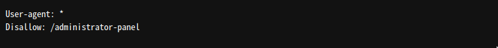
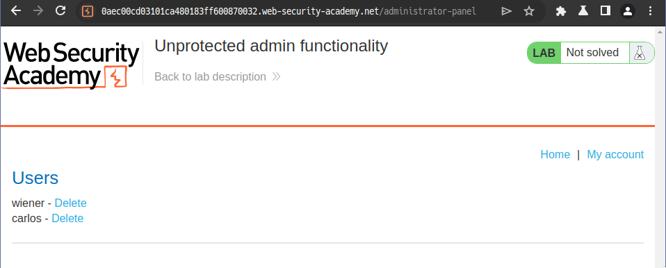
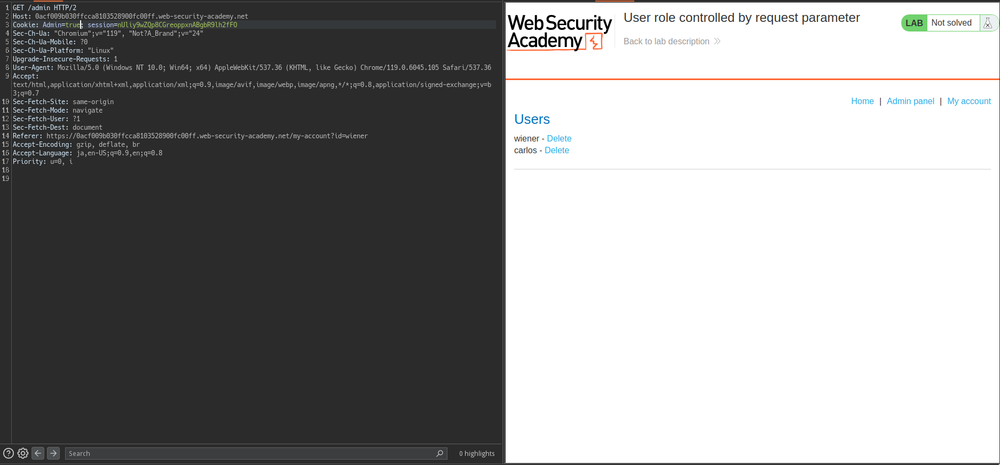
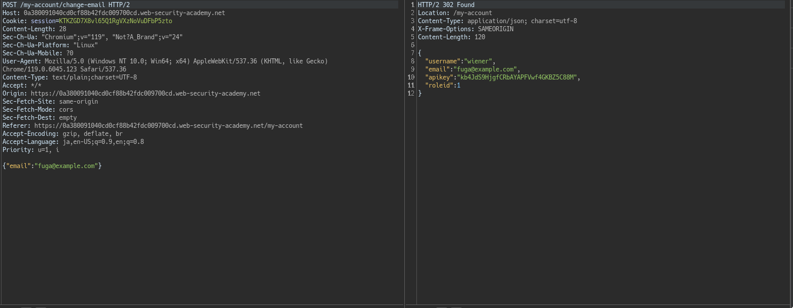
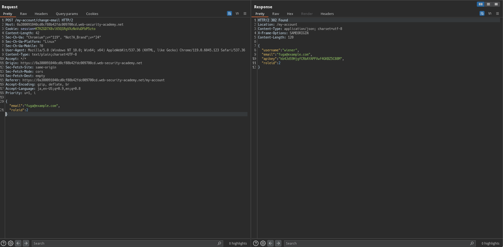
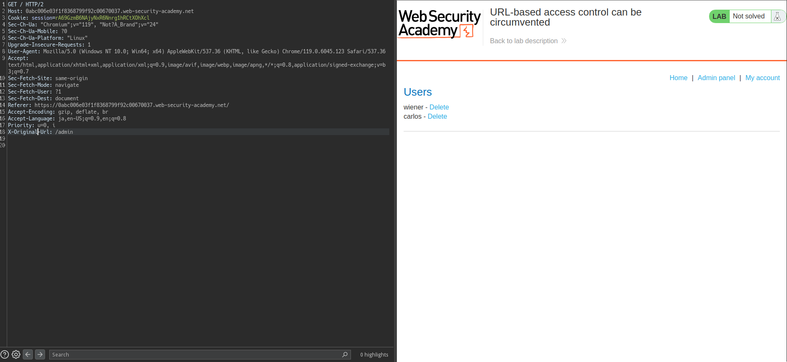
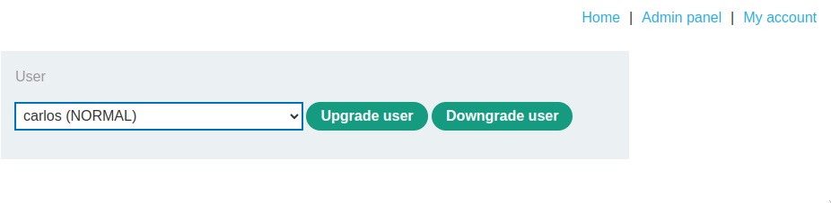
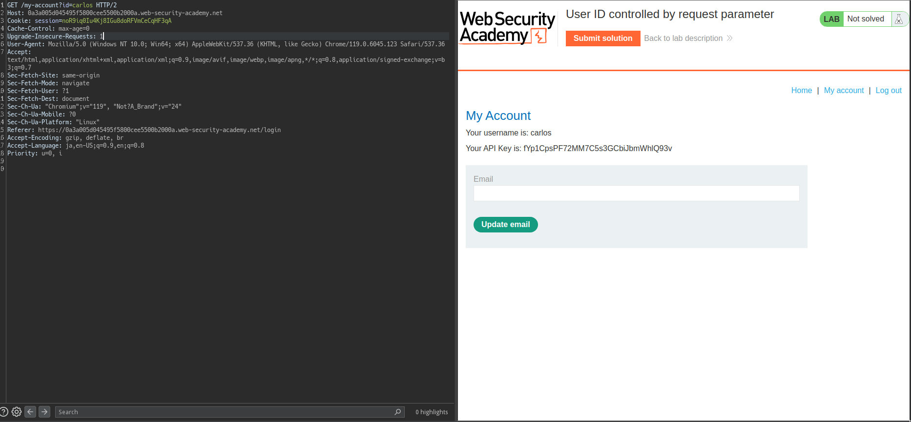
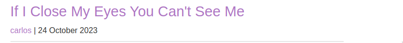
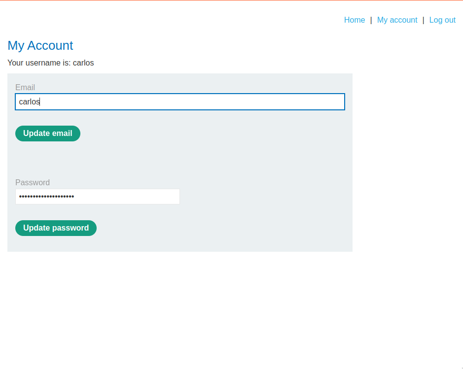

# Access Control

##  Unprotected admin functionality

### Goal
```
This lab has an unprotected admin panel.

Solve the lab by deleting the user carlos.
```

### Analyze & Exploit

`/robots.txt`を眺めると



Accessすると、以下の画面に。



やるだけ。

## Unprotected admin functionality with unpredictable URL

### Goal

```text
This lab has an unprotected admin panel. It's located at an unpredictable location, but the location is disclosed somewhere in the application.

Solve the lab by accessing the admin panel, and using it to delete the user carlos.
```

### Analyze & Exploit

```html
<script>
var isAdmin = false;
if (isAdmin) {
   var topLinksTag = document.getElementsByClassName("top-links")[0];
   var adminPanelTag = document.createElement('a');
   adminPanelTag.setAttribute('href', '/admin-eoip5v');
   adminPanelTag.innerText = 'Admin panel';
   topLinksTag.append(adminPanelTag);
   var pTag = document.createElement('p');
   pTag.innerText = '|';
   topLinksTag.appendChild(pTag);
}
</script>
```

`/product?productId=?`に合った。

アクセスして消すだけ。

## User role controlled by request parameter

### Goal
```text
This lab has an admin panel at /admin, which identifies administrators using a forgeable cookie.

Solve the lab by accessing the admin panel and using it to delete the user carlos.

You can log in to your own account using the following credentials: wiener:peter
```

### Analyze & Exploit

loginすると、以下のような`Set-Cookie`

```text
Set-Cookie: Admin=false; Secure; HttpOnly
Set-Cookie: session=nUliy9wZQp8CGreoppxnABgbR9lh2fFO; 
```

`Admin=true`にして、`/admin`にアクセスしてみる。



あとはcarlosを消すだけ。

## User role can be modified in user profile

### Goal

```text
This lab has an admin panel at /admin. It's only accessible to logged-in users with a roleid of 2.

Solve the lab by accessing the admin panel and using it to delete the user carlos.

You can log in to your own account using the following credentials: wiener:peter
```

### Analyze & Exploit

処理が怪しそうなのは、`Update email`部分でしょう。



`roled: 2`とすると、`roleid`が変更されたことがわかります。



`/my-account`にアクセスすると、`Admin Panel`が出るのでアクセスして消せばおけです。

## Lab: URL-based access control can be circumvented

### Goal

```text
This website has an unauthenticated admin panel at /admin, but a front-end system has been configured to block external access to that path. However, the back-end application is built on a framework that supports the X-Original-URL header.

To solve the lab, access the admin panel and delete the user carlos.
```

## Analyze & Exploit

アクセス時点で、`amdin panel`の存在は認識可能です


`Admin panel`にアクセスしても勿論無理です。

```text
HTTP/2 403 Forbidden
Content-Type: application/json; charset=utf-8
X-Frame-Options: SAMEORIGIN
Content-Length: 15

"Access denied"
```

このとき、`X-Original-Url: admin`を追加してあげることでアクセス可能なことを確認しました。



あとはやるだけです。

```bash
GET /?username=carlos HTTP/2
Host: 0abc006e03f1f8368799f92c00670037.web-security-academy.net
Cookie: session=rA69GzmB6NAjyNxR6Nnrg1hRCtXOhXcl
Sec-Ch-Ua: "Chromium";v="119", "Not?A_Brand";v="24"
Sec-Ch-Ua-Mobile: ?0
Sec-Ch-Ua-Platform: "Linux"
Upgrade-Insecure-Requests: 1
User-Agent: Mozilla/5.0 (Windows NT 10.0; Win64; x64) AppleWebKit/537.36 (KHTML, like Gecko) Chrome/119.0.6045.123 Safari/537.36
Accept: text/html,application/xhtml+xml,application/xml;q=0.9,image/avif,image/webp,image/apng,*/*;q=0.8,application/signed-exchange;v=b3;q=0.7
Sec-Fetch-Site: same-origin
Sec-Fetch-Mode: navigate
Sec-Fetch-User: ?1
Sec-Fetch-Dest: document
Referer: https://0abc006e03f1f8368799f92c00670037.web-security-academy.net/
Accept-Encoding: gzip, deflate, br
Accept-Language: ja,en-US;q=0.9,en;q=0.8
Priority: u=0, i
X-Original-Url: /admin/delete
```

## Method-based access control can be circumvented

```text
This lab implements access controls based partly on the HTTP method of requests. You can familiarize yourself with the admin panel by logging in using the credentials administrator:admin.

To solve the lab, log in using the credentials wiener:peter and exploit the flawed access controls to promote yourself to become an administrator.
```

### Analyze & Exploit


Admin panelではユーザの権限を変更可能です。


その際のリクエストは、adminしかできなさそうです

```text
POST /admin-roles HTTP/2
Host: 0a7b003404642be2813f20df00a600c7.web-security-academy.net
...

username=wiener&action=upgrade
```

このとき、`GET method`にすることで、`NORMAL`権限のアカウントから`ADMIN`権限に変更することができ、ラボも一緒にクリアされます。

## User ID controlled by request parameter

### Goal

```text
This lab has a horizontal privilege escalation vulnerability on the user account page.

To solve the lab, obtain the API key for the user carlos and submit it as the solution.

You can log in to your own account using the following credentials: wiener:peter
```

### Analyze & Exploit

ログインすると、`https://domain/my-account?id=wiener`というエンドポイントが見える。

`id=calos`にすると、carlosの情報が見えてしまう。



## User ID controlled by request parameter, with unpredictable user IDs

### Goal

```text
This lab has a horizontal privilege escalation vulnerability on the user account page, but identifies users with GUIDs.

To solve the lab, find the GUID for carlos, then submit his API key as the solution.

You can log in to your own account using the following credentials: wiener:peter
```

### Analyze & Exploit

`wiener:peter`でログインすると、以下のような予測不可能なidがついていることに気づく

```
my-account?id=a8861f82-9c67-433e-9899-89e78a948d0b
```

次に、view postを開くと以下のようにlinkがあることがわかる。



リンクにアクセスすると、`https://0a8f00ac0469505680cfa80900b50087.web-security-academy.net/blogs?userId=97cf9c9a-1ed1-411b-b442-f1e9205acf9c`といった感じで、idが取得でき、`my-accound?id=`に値を打ち込めばヨシ。

##  User ID controlled by request parameter with data leakage in redirect
### Goal

```text
This lab contains an access control vulnerability where sensitive information is leaked in the body of a redirect response.

To solve the lab, obtain the API key for the user carlos and submit it as the solution.

You can log in to your own account using the following credentials: wiener:peter
```

### Analyze & Exploit

こんなのがあり得るのか。。

```html
HTTP/2 302 Found
Location: /login

<!DOCTYPE html>
<html>
    <head>
        <link href=/resources/labheader/css/academyLabHeader.css rel=stylesheet>
        <link href=/resources/css/labs.css rel=stylesheet>
        <title>User ID controlled by request parameter with data leakage in redirect</title>
    </head>
    <body>
        <script src="/resources/labheader/js/labHeader.js"></script>
        ...
        <div theme="">
            <section class="maincontainer">
                <div class="container is-page">
                    <div id=account-content>
                        <div>Your API Key is: fpJhkdDMEX9WdjT2kBOUSUtNYsivgifj</div><br/>
                    </div>
                </div>
            </section>
            <div class="footer-wrapper">
            </div>
        </div>
    </body>
</html>

```

## User ID controlled by request parameter with password disclosure
### Goal

```text
This lab has user account page that contains the current user's existing password, prefilled in a masked input.

To solve the lab, retrieve the administrator's password, then use it to delete the user carlos.

You can log in to your own account using the following credentials: wiener:peter
```

### Analyze & Exploit

`wiener:peter`でログインをし、`/my-account?id=carlos`にすると、carlosのアカウントにアクセスできます。



アカウントを掌握するために、Email, Passwordを変更しておきます。


