# Bussiness Logic Vulnerability

## Excessive trust in client-side controls
### Overview

```text
This lab doesn't adequately validate user input. You can exploit a logic flaw in its purchasing workflow to buy items for an unintended price. To solve the lab, buy a "Lightweight l33t leather jacket".

You can log in to your own account using the following credentials: wiener:peter
```

### Analyze & Exploit

多分購入処理を行うには、ログインする必要がありそうなので、`wiener:peter`でログインを行っておきます。

Loginをすると、`$100`を保持していることがわかります。

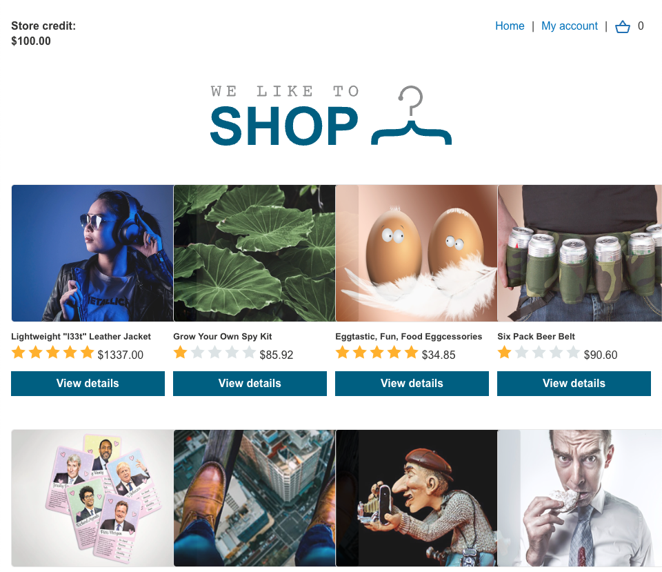

Leather Jacketは、`$1337.00`なので持ち金では購入することができません。

とりあえず、Leather Jacketを`Add to cart`して、`/cart`に移ります。

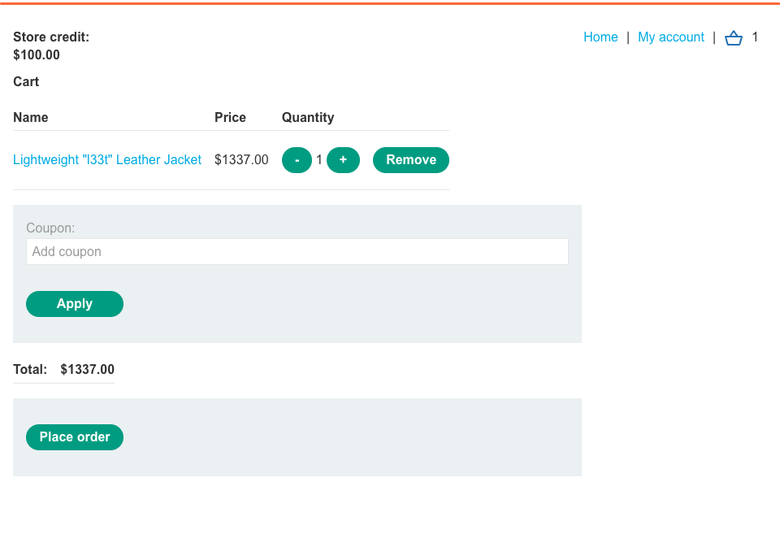

`Place order`をしても購入できないことを確かめます。

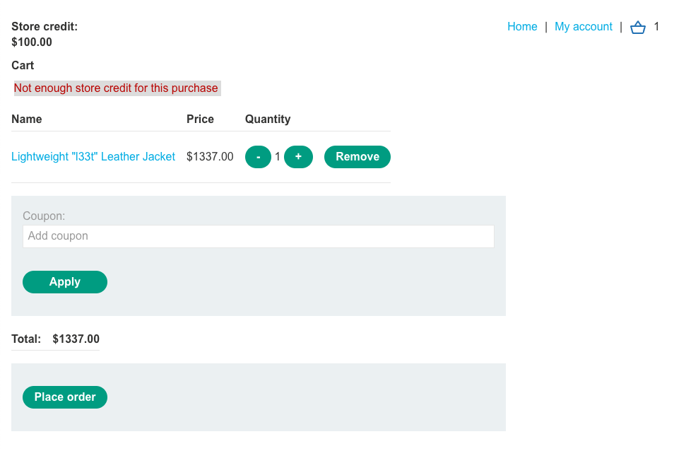

続いて、購入時のリクエストを眺めます。

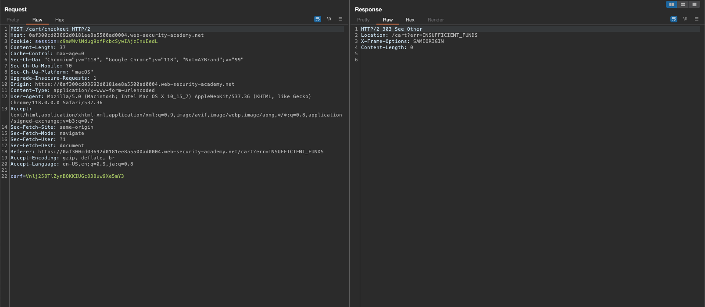

このリクエストでは、`csrf token`らしきもの以外は送っていないことから`Add to cart`時点でリクエストをいじる必要がありそうです。

`Add to cart`
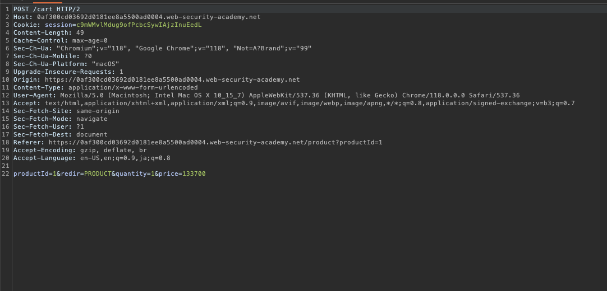

この時、price parameterを`1`にすると、`cart`での値段が先ほどと違うことがわかります。j

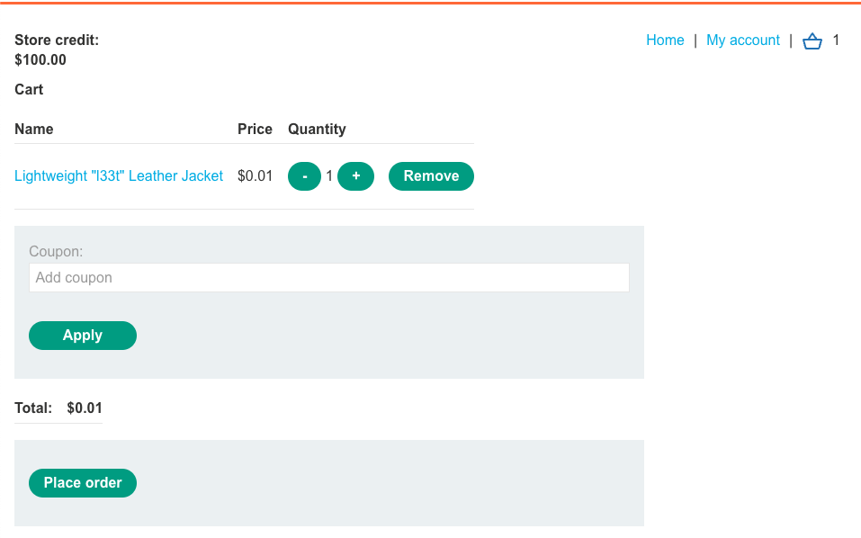

再度`Place order`を押下し、ラボがクリアされます。

## 2FA broken logic

### Overview

```text
This lab's two-factor authentication is vulnerable due to its flawed logic. To solve the lab, access Carlos's account page.

Your credentials: wiener:peter
Victim's username: carlos
You also have access to the email server to receive your 2FA verification code
```

### Analyze & Exploit

ログイン処理を見ていきます。

POST /login: username:passwd -> GET /login2 -> POST /login2: mfa code

この時、`POST /login`で成功した場合、cookieにj`verify=wiener`がついています。

GET時点で変更しても、認証コードは送られてきていないことから、GETのverifyを見て認証コードを送っていることがわかります。

`POST /login2`に対して変更をかけてもうまくいかないことから他の方法を模索する必要がありそうです。

TOKENの有効期限には言及がないことから、有効期限なしだと仮定し、4桁なのでブルートフォースで総当たりできそうなことがわかります。

`POST /login`で、`wiener:peter`を入れ、`GET /login2`のCookie `verify=wiener`を、`verify=carlos`に変更し、mfaを作成させ、`POST /logiin2`に対してブルートフォースという流れを行います。

`POST /login2`の`verify`を`carlos`にすることを忘れないようにする必要があります。

これがうまくいくと、passwordなしにログインすることが可能となります。

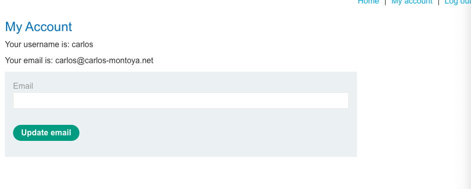

## High-level logic vulnerability

### Overview

```text
This lab doesn't adequately validate user input. You can exploit a logic flaw in its purchasing workflow to buy items for an unintended price. To solve the lab, buy a "Lightweight l33t leather jacket".

You can log in to your own account using the following credentials: wiener:peter
```

### Analyze & Exploit

`wiener:peter`でログインすると、持ち金が$100であることがわかります。

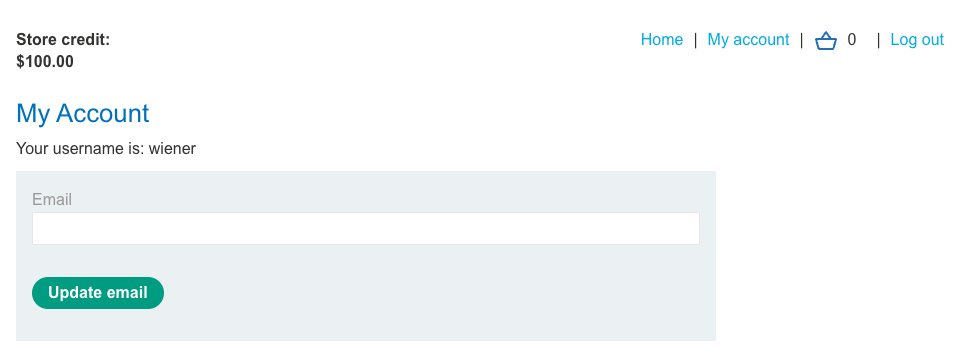

Leather Jacketは、`$1337.00`なので、理論上購入はできるはずがありません。

購入時のリクエストは、`csrf`のみしかなく、悪用ができそうにありません。

```text
POST /cart/checkout HTTP/2
Host: 0a1100a403bbe42b8178496000630049.web-security-academy.net
Cookie: session=s6VUIya9htfWM9K0xyvTCKq38qlLorvB
Content-Length: 37
Cache-Control: max-age=0
Sec-Ch-Ua: "Chromium";v="118", "Google Chrome";v="118", "Not=A?Brand";v="99"
Sec-Ch-Ua-Mobile: ?0
Sec-Ch-Ua-Platform: "macOS"
Upgrade-Insecure-Requests: 1
Origin: https://0a1100a403bbe42b8178496000630049.web-security-academy.net
Content-Type: application/x-www-form-urlencoded
User-Agent: Mozilla/5.0 (Macintosh; Intel Mac OS X 10_15_7) AppleWebKit/537.36 (KHTML, like Gecko) Chrome/118.0.0.0 Safari/537.36
Accept: text/html,application/xhtml+xml,application/xml;q=0.9,image/avif,image/webp,image/apng,*/*;q=0.8,application/signed-exchange;v=b3;q=0.7
Sec-Fetch-Site: same-origin
Sec-Fetch-Mode: navigate
Sec-Fetch-User: ?1
Sec-Fetch-Dest: document
Referer: https://0a1100a403bbe42b8178496000630049.web-security-academy.net/cart
Accept-Encoding: gzip, deflate, br
Accept-Language: en-US,en;q=0.9,ja;q=0.8

csrf=uQkl5ressFwaF9cnCk3fy1lGVRFChLcd
```

`Add to cart`時のリクエストを見ていきます。

```text
POST /cart HTTP/2
Host: 0a1100a403bbe42b8178496000630049.web-security-academy.net
Cookie: session=s6VUIya9htfWM9K0xyvTCKq38qlLorvB
Content-Length: 36
Cache-Control: max-age=0
Sec-Ch-Ua: "Chromium";v="118", "Google Chrome";v="118", "Not=A?Brand";v="99"
Sec-Ch-Ua-Mobile: ?0
Sec-Ch-Ua-Platform: "macOS"
Upgrade-Insecure-Requests: 1
Origin: https://0a1100a403bbe42b8178496000630049.web-security-academy.net
Content-Type: application/x-www-form-urlencoded
User-Agent: Mozilla/5.0 (Macintosh; Intel Mac OS X 10_15_7) AppleWebKit/537.36 (KHTML, like Gecko) Chrome/118.0.0.0 Safari/537.36
Accept: text/html,application/xhtml+xml,application/xml;q=0.9,image/avif,image/webp,image/apng,*/*;q=0.8,application/signed-exchange;v=b3;q=0.7
Sec-Fetch-Site: same-origin
Sec-Fetch-Mode: navigate
Sec-Fetch-User: ?1
Sec-Fetch-Dest: document
Referer: https://0a1100a403bbe42b8178496000630049.web-security-academy.net/product?productId=1
Accept-Encoding: gzip, deflate, br
Accept-Language: en-US,en;q=0.9,ja;q=0.8

productId=1&redir=PRODUCT&quantity=1
```

特に値段などはないです。

`quantity`に対して`-1`を入れると値が受け入れられていそうです。

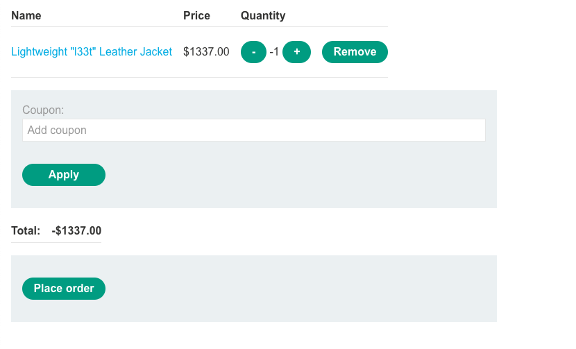

これに何かのアイテムを追加すると、いい感じに正数になります

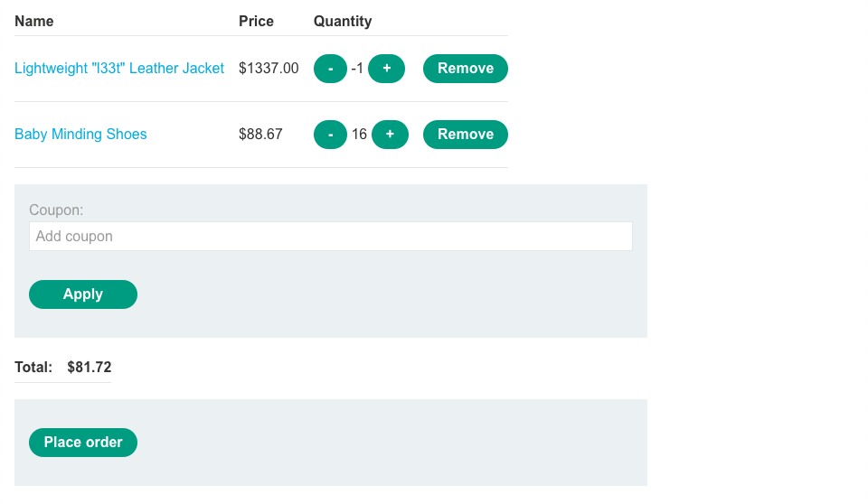

これで購入すればクリアできるはずです。

## Low-level logic flaw

### Overview

```text
This lab doesn't adequately validate user input. You can exploit a logic flaw in its purchasing workflow to buy items for an unintended price. To solve the lab, buy a "Lightweight l33t leather jacket".

You can log in to your own account using the following credentials: wiener:peter
```


### Analyze & Exploit

`wiener:peter`でログインし、leather jacketをAdd to cartする際のリクエストを眺めてみます。

```text
POST /cart HTTP/2
Host: 0a9200ee034f6cbe85a36d8b00630086.web-security-academy.net
Cookie: session=vRFMSD60ThVNxQPAFIlW5wGBmBzHmVUZ
Content-Length: 36
Cache-Control: max-age=0
Sec-Ch-Ua: "Chromium";v="118", "Google Chrome";v="118", "Not=A?Brand";v="99"
Sec-Ch-Ua-Mobile: ?0
Sec-Ch-Ua-Platform: "macOS"
Upgrade-Insecure-Requests: 1
Origin: https://0a9200ee034f6cbe85a36d8b00630086.web-security-academy.net
Content-Type: application/x-www-form-urlencoded
User-Agent: Mozilla/5.0 (Macintosh; Intel Mac OS X 10_15_7) AppleWebKit/537.36 (KHTML, like Gecko) Chrome/118.0.0.0 Safari/537.36
Accept: text/html,application/xhtml+xml,application/xml;q=0.9,image/avif,image/webp,image/apng,*/*;q=0.8,application/signed-exchange;v=b3;q=0.7
Sec-Fetch-Site: same-origin
Sec-Fetch-Mode: navigate
Sec-Fetch-User: ?1
Sec-Fetch-Dest: document
Referer: https://0a9200ee034f6cbe85a36d8b00630086.web-security-academy.net/product?productId=1
Accept-Encoding: gzip, deflate, br
Accept-Language: en-US,en;q=0.9,ja;q=0.8

productId=1&redir=PRODUCT&quantity=1
```

-1を入れると、カートには入っていそうだが、表示されないという謎状況になります。

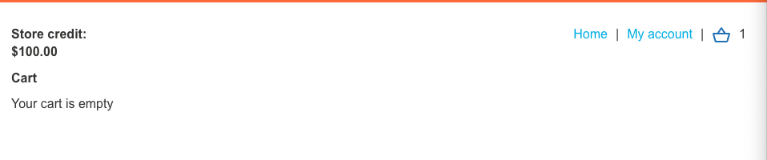

ですが、特に何もできません。

quantityはテストしていくうちに99以上は選べなさそうな雰囲気を感じます。

1万7千件くらいレザージャケットをカートに入れておくと、負数が表示されるようになります。

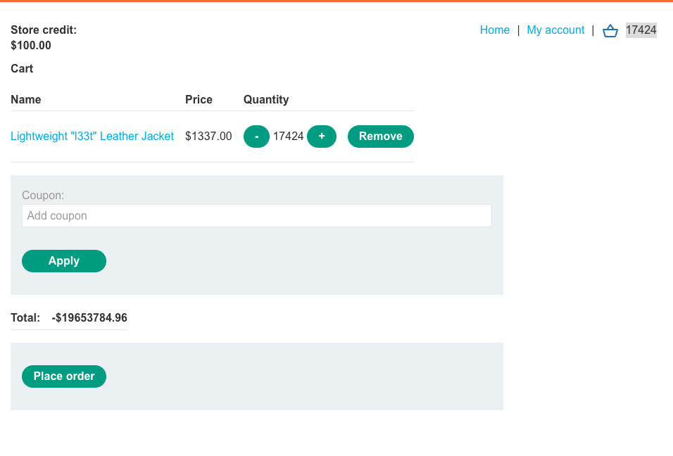

これをいい感じにすると、以下のように購入できる値段になり購入ボタンを押すだけです。

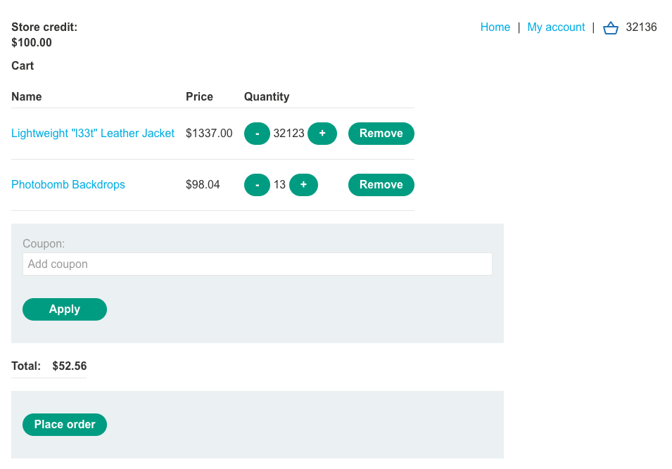

